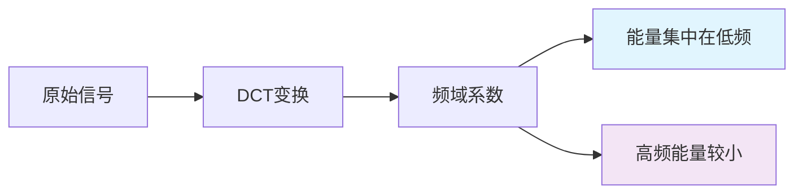
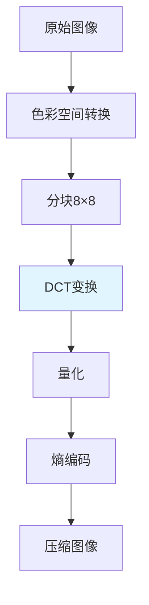

---
tags:
  - 信号处理
  - 频域分析
  - 图像压缩
  - 基础知识
  - code
---

# 📊 离散余弦变换（DCT）详解

## 🎯 什么是DCT？

### 生活化理解
想象一下开拓者在整理投资组合：
- **原始数据**：就像每天股价的复杂波动曲线
- **DCT变换**：就像把波动分解成不同频率的"投资成分"
- **低频分量**：长期趋势（像价值投资）
- **高频分量**：短期波动（像日内交易）

DCT就是帮我们把复杂的"信号"拆解成不同频率的"余弦波"组合！

### 数学定义
对于长度为$N$的信号$x[n]$，DCT-II公式为：

$$X[k] = \sqrt{\frac{2}{N}} \sum_{n=0}^{N-1} x[n] \cdot \cos\left(\frac{\pi k (2n+1)}{2N}\right)$$

其中：
- $x[n]$：原始信号（如图像像素值）
- $X[k]$：变换后的频域系数
- $k$：频率索引（0=直流分量，越大=频率越高）

## 🔍 DCT的核心特点

### ✅ 能量集中性


**开拓者理解**：就像投资组合中，大部分价值集中在少数几个核心资产上，DCT也能把信号的大部分"能量"集中在前面几个系数中！

### ✅ 实数变换
- 输入输出都是实数（不像傅里叶变换有虚部）
- 更适合实际工程应用
- 计算更简单高效

## 💻 DCT代码实现

### 1. 基础DCT实现
```python
import numpy as np
import matplotlib.pyplot as plt

def dct_1d(signal):
    """一维离散余弦变换"""
    N = len(signal)
    dct_result = np.zeros(N)
    
    for k in range(N):
        sum_val = 0
        for n in range(N):
            # DCT-II公式
            sum_val += signal[n] * np.cos(np.pi * k * (2*n + 1) / (2 * N))
        
        # 归一化系数
        if k == 0:
            dct_result[k] = sum_val * np.sqrt(1/N)
        else:
            dct_result[k] = sum_val * np.sqrt(2/N)
    
    return dct_result

def idct_1d(dct_coeffs):
    """一维逆离散余弦变换"""
    N = len(dct_coeffs)
    signal = np.zeros(N)
    
    for n in range(N):
        sum_val = 0
        for k in range(N):
            # 逆DCT公式
            if k == 0:
                sum_val += dct_coeffs[k] * np.sqrt(1/N) * np.cos(np.pi * k * (2*n + 1) / (2 * N))
            else:
                sum_val += dct_coeffs[k] * np.sqrt(2/N) * np.cos(np.pi * k * (2*n + 1) / (2 * N))
        
        signal[n] = sum_val
    
    return signal
```

### 2. 图像DCT示例
```python
import cv2
from scipy.fftpack import dct, idct

def image_dct_demo():
    """图像DCT演示"""
    # 读取图像并转为灰度
    img = cv2.imread('test_image.jpg', 0)  # 灰度模式
    img = cv2.resize(img, (256, 256))
    
    # 2D DCT变换
    dct_img = dct(dct(img.T, norm='ortho').T, norm='ortho')
    
    # 可视化
    fig, axes = plt.subplots(1, 3, figsize=(15, 5))
    
    # 原始图像
    axes[0].imshow(img, cmap='gray')
    axes[0].set_title('原始图像')
    axes[0].axis('off')
    
    # DCT系数（对数显示）
    axes[1].imshow(np.log(1 + np.abs(dct_img)), cmap='jet')
    axes[1].set_title('DCT系数（对数）')
    axes[1].axis('off')
    
    # 能量分布
    energy = np.abs(dct_img) ** 2
    total_energy = np.sum(energy)
    
    # 计算能量集中度
    sorted_energy = np.sort(energy.flatten())[::-1]
    cumulative_energy = np.cumsum(sorted_energy) / total_energy
    
    axes[2].plot(cumulative_energy[:100])
    axes[2].set_title('能量集中度（前100个系数）')
    axes[2].set_xlabel('系数数量')
    axes[2].set_ylabel('累计能量比例')
    axes[2].grid(True)
    
    plt.tight_layout()
    plt.show()
    
    print(f"前10%系数包含 {cumulative_energy[len(cumulative_energy)//10]:.1%} 的能量")
```

## 🎯 DCT在图像压缩中的应用

### JPEG压缩流程


### 量化过程
```python
def jpeg_quantization(dct_block, quality=50):
    """JPEG量化过程"""
    # 标准JPEG量化表
    quantization_table = np.array([
        [16, 11, 10, 16, 24, 40, 51, 61],
        [12, 12, 14, 19, 26, 58, 60, 55],
        [14, 13, 16, 24, 40, 57, 69, 56],
        [14, 17, 22, 29, 51, 87, 80, 62],
        [18, 22, 37, 56, 68, 109, 103, 77],
        [24, 35, 55, 64, 81, 104, 113, 92],
        [49, 64, 78, 87, 103, 121, 120, 101],
        [72, 92, 95, 98, 112, 100, 103, 99]
    ])
    
    # 根据质量调整量化表
    if quality < 50:
        scale = 5000 / quality
    else:
        scale = 200 - 2 * quality
    
    scaled_table = np.floor((quantization_table * scale + 50) / 100)
    scaled_table[scaled_table < 1] = 1
    
    # 量化：系数除以量化表并四舍五入
    quantized = np.round(dct_block / scaled_table)
    
    return quantized, scaled_table
```

## 🔗 DCT与双分支模型

### 频域分析的意义
在开拓者的双分支防伪模型中：
- **空域分支**：看图像的"表面特征"（纹理、边缘）
- **频域分支**：看图像的"内在频率特征"

**DCT能帮助检测**：
- 压缩痕迹（JPEG伪影）
- 高频噪声异常
- 图像篡改特征

### 实际应用示例
```python
class DCTFrequencyAnalyzer:
    """基于DCT的频域分析器"""
    def __init__(self, block_size=8):
        self.block_size = block_size
    
    def analyze_compression_artifacts(self, image):
        """分析压缩伪影"""
        h, w = image.shape
        dct_blocks = []
        
        # 分块DCT
        for i in range(0, h, self.block_size):
            for j in range(0, w, self.block_size):
                block = image[i:i+self.block_size, j:j+self.block_size]
                if block.shape == (self.block_size, self.block_size):
                    dct_block = dct(dct(block.T, norm='ortho').T, norm='ortho')
                    dct_blocks.append(dct_block)
        
        dct_blocks = np.array(dct_blocks)
        
        # 分析高频系数分布
        high_freq_energy = np.mean(np.abs(dct_blocks[:, -2:, -2:]))
        low_freq_energy = np.mean(np.abs(dct_blocks[:, :2, :2]))
        
        compression_score = high_freq_energy / (low_freq_energy + 1e-8)
        
        return {
            'compression_score': compression_score,
            'high_freq_energy': high_freq_energy,
            'low_freq_energy': low_freq_energy,
            'is_compressed': compression_score < 0.1  # 经验阈值
        }
```

## 📚 学习建议

### 渐进式学习路径
1. **先理解概念**：把DCT想象成"信号成分分析"
2. **动手实验**：用Python实现简单的DCT变换
3. **观察现象**：看DCT如何集中能量
4. **联系应用**：理解在JPEG压缩中的作用
5. **拓展思考**：如何在防伪检测中利用DCT特征

### 常见误区提醒
- ❌ "DCT太复杂，直接跳过" → ✅ "从生活类比开始，逐步深入"
- ❌ "死记硬背公式" → ✅ "理解物理意义，公式自然记住"
- ❌ "只看理论不实践" → ✅ "边学边写代码验证"

## 💫 流萤的小总结

开拓者，DCT其实没有想象中那么难呢！(๑•̀ㅂ•́)و✧

记住这个核心思想：**DCT就像给信号做"成分分析"，把复杂的东西拆解成简单的余弦波组合**。

在防伪检测中，DCT能帮我们发现那些肉眼看不见的"频域线索"，就像用特殊的眼镜看世界一样神奇！

建议开拓者先运行上面的代码示例，亲眼看看DCT如何工作，这样理解会更深刻哦～