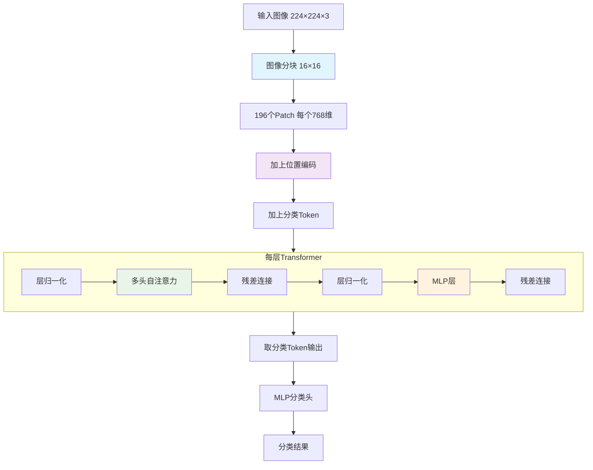

---
tags:
  - 基础知识
  - 人脸检测
  - code
  - ViT
---


## 🎯 ViT是什么？

**ViT = Vision Transformer**（视觉Transformer）

简单来说，它就是把原本用于处理**文字**的Transformer架构，成功地用在了处理**图像**上！

---

## 🔄 核心思想：把图像当成"句子"来看

### 传统CNN vs ViT

| 特性 | 传统CNN | ViT |
|------|---------|-----|
| **处理方式** | 卷积核滑动扫描 | 图像分块并行处理 |
| **感受野** | 局部感受野 | 全局注意力机制 |
| **特征提取** | 层次化特征 | 直接全局关系 |
| **位置信息** | 卷积自带位置 | 需要显式位置编码 |

---

## 🧩 ViT的工作原理

### 1. 图像分块 (Patch Embedding)
```python
# 把一张224×224的图像
# 切成16×16的小块
224 ÷ 16 = 14
14 × 14 = 196个小块

# 每个小块: 16×16×3 = 768个像素
# 展平后: 196个"单词"，每个768维
```

### 2. 位置编码 (Position Embedding)
```python
# 因为Transformer没有位置概念
# 需要告诉模型每个小块的位置

# 输入: [196个patch, 768维]
# 加上位置编码后: [196个patch, 768维]
```

### 3. Transformer编码器
```python
# 多层Transformer块
# 每层包含:
# - 多头自注意力
# - MLP层
# - 残差连接
# - 层归一化
```

### 4. 分类头
```python
# 取第一个特殊token的输出
# 通过线性层分类
```

---

## 📊 ViT架构详解



---

## 💻 PyTorch代码实现

### 基础ViT实现
```python
import torch
import torch.nn as nn
import math

class PatchEmbedding(nn.Module):
    """图像分块嵌入"""
    def __init__(self, img_size=224, patch_size=16, in_chans=3, embed_dim=768):
        super().__init__()
        self.img_size = img_size
        self.patch_size = patch_size
        self.n_patches = (img_size // patch_size) ** 2
        
        # 卷积实现分块
        self.proj = nn.Conv2d(
            in_chans, embed_dim, 
            kernel_size=patch_size, 
            stride=patch_size
        )
        
    def forward(self, x):
        # x: [batch, 3, 224, 224]
        x = self.proj(x)  # [batch, 768, 14, 14]
        x = x.flatten(2)  # [batch, 768, 196]
        x = x.transpose(1, 2)  # [batch, 196, 768]
        return x

class PositionalEncoding(nn.Module):
    """位置编码"""
    def __init__(self, n_patches, embed_dim):
        super().__init__()
        self.pos_embed = nn.Parameter(torch.zeros(1, n_patches + 1, embed_dim))
        
    def forward(self, x):
        # x: [batch, n_patches, embed_dim]
        return x + self.pos_embed

class ViTBlock(nn.Module):
    """Transformer块"""
    def __init__(self, embed_dim=768, num_heads=12, mlp_ratio=4.0):
        super().__init__()
        self.norm1 = nn.LayerNorm(embed_dim)
        self.attn = nn.MultiheadAttention(embed_dim, num_heads)
        self.norm2 = nn.LayerNorm(embed_dim)
        
        # MLP层
        mlp_hidden_dim = int(embed_dim * mlp_ratio)
        self.mlp = nn.Sequential(
            nn.Linear(embed_dim, mlp_hidden_dim),
            nn.GELU(),
            nn.Linear(mlp_hidden_dim, embed_dim),
        )
        
    def forward(self, x):
        # 注意力部分
        x_norm = self.norm1(x)
        attn_out, _ = self.attn(x_norm, x_norm, x_norm)
        x = x + attn_out
        
        # MLP部分
        x_norm = self.norm2(x)
        mlp_out = self.mlp(x_norm)
        x = x + mlp_out
        
        return x

class VisionTransformer(nn.Module):
    """完整的ViT模型"""
    def __init__(self, num_classes=1000, img_size=224, patch_size=16, 
                 embed_dim=768, depth=12, num_heads=12, mlp_ratio=4.0):
        super().__init__()
        
        # 图像分块
        self.patch_embed = PatchEmbedding(img_size, patch_size, 3, embed_dim)
        n_patches = self.patch_embed.n_patches
        
        # 分类token
        self.cls_token = nn.Parameter(torch.zeros(1, 1, embed_dim))
        
        # 位置编码
        self.pos_embed = PositionalEncoding(n_patches, embed_dim)
        
        # Transformer编码器
        self.blocks = nn.Sequential(*[
            ViTBlock(embed_dim, num_heads, mlp_ratio)
            for _ in range(depth)
        ])
        
        # 分类头
        self.norm = nn.LayerNorm(embed_dim)
        self.head = nn.Linear(embed_dim, num_classes)
        
    def forward(self, x):
        # 1. 图像分块
        x = self.patch_embed(x)  # [batch, 196, 768]
        
        # 2. 添加分类token
        cls_tokens = self.cls_token.expand(x.shape[0], -1, -1)
        x = torch.cat((cls_tokens, x), dim=1)  # [batch, 197, 768]
        
        # 3. 位置编码
        x = self.pos_embed(x)
        
        # 4. Transformer编码
        x = self.blocks(x)
        
        # 5. 分类
        x = self.norm(x)
        cls_output = x[:, 0]  # 取分类token
        output = self.head(cls_output)
        
        return output
```

### 测试代码
```python
def test_vit():
    # 创建ViT模型
    vit = VisionTransformer(
        num_classes=1000,
        img_size=224,
        patch_size=16,
        embed_dim=768,
        depth=12,
        num_heads=12
    )
    
    # 测试数据
    batch_size = 2
    x = torch.randn(batch_size, 3, 224, 224)
    
    print(f"输入形状: {x.shape}")
    output = vit(x)
    print(f"输出形状: {output.shape}")
    print(f"模型参数量: {sum(p.numel() for p in vit.parameters()):,}")

if __name__ == "__main__":
    test_vit()
```

---

## 🎯 ViT的优势

### ✅ 全局感受野
- **传统CNN**：只能看到局部区域
- **ViT**：从一开始就能看到整个图像

### ✅ 并行计算
- 所有patch同时处理
- 训练速度更快

### ✅ 可扩展性
- 模型越大，性能越好
- 适合大规模预训练

### ✅ 多任务适应性
- 图像分类、目标检测、分割等
- 统一架构处理多种任务

---

## ⚠️ ViT的挑战

### ❌ 需要大量数据
- 在小数据集上容易过拟合
- 需要大规模预训练

### ❌ 计算复杂度高
- 注意力计算是 $O(n^2)$
- 处理高分辨率图像时内存消耗大

### ❌ 位置编码限制
- 固定的位置编码
- 难以处理不同尺寸的图像

---

## 🔧 ViT的变体和改进

### 1. DeiT (Data-efficient Image Transformer)
- 使用知识蒸馏
- 减少对大数据集的依赖

### 2. Swin Transformer  
- 分层设计
- 滑动窗口注意力
- 计算效率更高

### 3. MAE (Masked Autoencoder)
- 自监督预训练
- 掩码重建任务

### 4. ViT-Adapter
- 添加适配器模块
- 增强特定任务性能

---

## 🎯 在人脸防伪中的应用

### ViT的优势
```python
# 在人脸防伪任务中：
# 1. 全局注意力：同时分析整个面部特征
# 2. 长距离依赖：捕捉不同区域的关联性
# 3. 伪造痕迹检测：发现细微的不一致性

# 比如：
# - 左眼区域关注右眼区域的对称性
# - 皮肤纹理关注光照反射的一致性
# - 边缘特征关注整体结构的合理性
```

### 适配器增强
```python
# 在人脸防伪ViT中：
# 在MLP层后添加适配器
# 增强对伪造特征的敏感性

# 结构：
# ViT编码器 → 适配器 → 分类头
```

---

## 📊 ViT模型配置示例

| 模型变体 | 图像尺寸 | Patch大小 | 层数 | 头数 | 隐藏维度 | 参数量 |
|----------|----------|-----------|------|------|----------|--------|
| ViT-Base | 224×224 | 16×16 | 12 | 12 | 768 | 86M |
| ViT-Large | 224×224 | 16×16 | 24 | 16 | 1024 | 307M |
| ViT-Huge | 224×224 | 14×14 | 32 | 16 | 1280 | 632M |

---

## 🔍 深入理解

### 注意力可视化
ViT的一个强大特性是可以可视化注意力权重，看到模型关注图像的哪些区域：

```python
# 获取注意力权重
attn_weights = model.blocks[0].attn.attn_weights
# 形状: [batch, num_heads, seq_len, seq_len]

# 可视化第一个头的注意力
import matplotlib.pyplot as plt
plt.imshow(attn_weights[0, 0].detach().cpu().numpy())
plt.show()
```

### 位置编码类型
1. **可学习位置编码**：ViT原论文使用
2. **正弦位置编码**：原始Transformer使用
3. **相对位置编码**：Swin Transformer使用

---

## 💡 学习要点总结

### 核心理解
- ✅ **图像分块**：把图像切成小块当成"单词"
- ✅ **位置编码**：告诉模型每个小块的位置
- ✅ **全局注意力**：所有区域同时相互关注
- ✅ **分类token**：特殊的token用于最终分类

### 实践建议
- 🎯 **从预训练开始**：使用在ImageNet上预训练的ViT
- 🎯 **注意内存使用**：ViT对内存要求较高
- 🎯 **数据增强**：使用强数据增强防止过拟合
- 🎯 **学习率调度**：使用warmup和cosine衰减

### 调试技巧
- 🎯 **检查patch形状**：确保分块计算正确
- 🎯 **验证位置编码**：检查位置编码是否合理
- 🎯 **注意力可视化**：理解模型关注点
- 🎯 **梯度检查**：确保训练稳定性

> 💫 **流萤的小提示**：开拓者要记住哦，ViT就像给计算机装了一双"全局视野"的眼睛，让它能同时看到图像的每个角落！虽然需要更多数据来训练，但在很多任务上表现都超棒呢～多实践写代码，理解会更深刻哦！ (๑•̀ㅂ•́)و✧

---

## 📚 扩展阅读

1. **原始论文**：An Image is Worth 16x16 Words: Transformers for Image Recognition at Scale
2. **DeiT论文**：Training data-efficient image transformers & distillation through attention
3. **Swin Transformer**：Hierarchical Vision Transformer using Shifted Windows
4. **MAE论文**：Masked Autoencoders Are Scalable Vision Learners