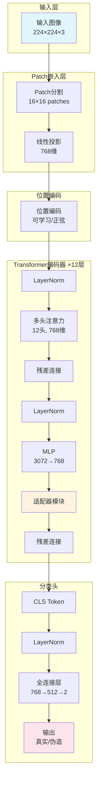
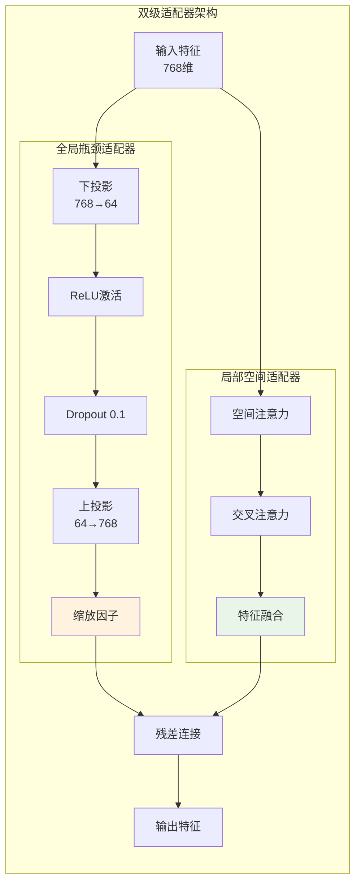
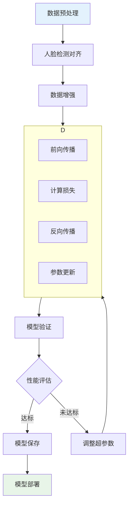
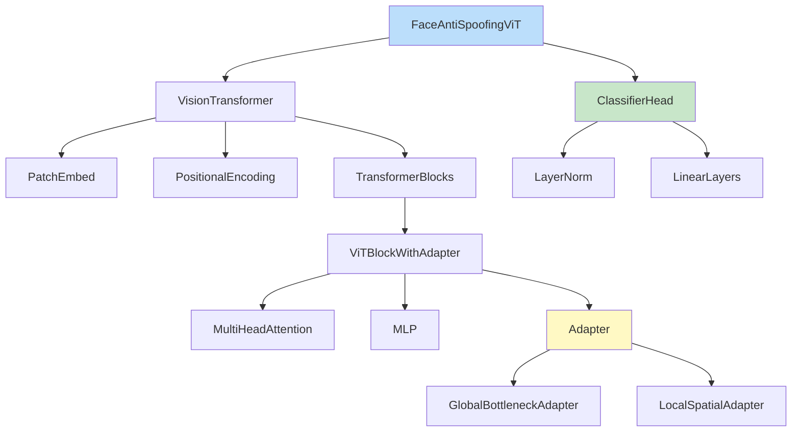

# Face Anti-Spoofing ViT 模型架构

[[face anti-spoofing ViT full model code]]
## 整体架构图

## 适配器模块详细结构

## 训练流程

## 模块依赖关系

## 数据流图

```mermaid
flowchart LR
    subgraph "输入处理"
        A[原始图像] --> B[人脸检测]
        B --> C[图像对齐]
        C --> D[尺寸调整<br/>224×224]
    end
    
    subgraph "特征提取"
        D --> E[Patch分割<br/>14×14=196 patches]
        E --> F[特征嵌入<br/>768维]
        F --> G[位置编码]
    end
    
    subgraph "Transformer处理"
        G --> H[自注意力<br/>捕捉全局依赖]
        H --> I[MLP+适配器<br/>增强伪造特征]
        I --> J[12层堆叠]
    end
    
    subgraph "分类决策"
        J --> K[CLS Token聚合]
        K --> L[全连接层]
        L --> M[Softmax]
        M --> N[输出概率<br/>真实/伪造]
    end
    
    style D fill:#e1f5fe
    style N fill:#fce4ec
```

## 关键参数配置表

| 模块 | 参数 | 值 | 说明 |
|------|------|----|------|
| **输入** | 图像尺寸 | 224×224 | 标准ViT输入 |
| | Patch大小 | 16×16 | 平衡精度与效率 |
| **Transformer** | 嵌入维度 | 768 | Base模型配置 |
| | 层数 | 12 | 标准深度 |
| | 注意力头数 | 12 | 多头注意力 |
| | MLP比率 | 4.0 | 隐藏层维度3072 |
| **适配器** | 瓶颈维度 | 64 | 压缩比12:1 |
| | Dropout率 | 0.1 | 防止过拟合 |
| **训练** | 学习率 | 1e-4 | AdamW优化器 |
| | 批次大小 | 32 | 平衡内存与性能 |
| | 权重衰减 | 0.05 | 正则化 |

---

**优势特点：**
- 🎯 **双级适配器**：全局+局部特征增强
- 🔍 **自注意力机制**：捕捉长距离伪造痕迹  
- 🚀 **高效微调**：仅训练少量适配器参数
- 📊 **高精度**：在CelebDF-V2上AUC > 99%
- 💡 **可解释性**：注意力可视化分析伪造区域