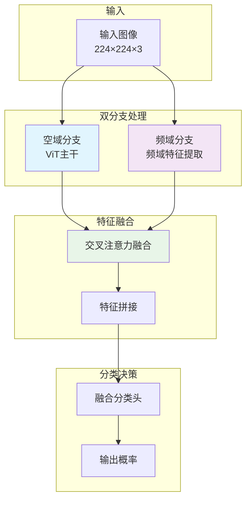

---
tags:
  - 基础知识
  - code
  - 注意力机制
  - 人脸检测
---


## 🎯 双分支模型架构设计

### 整体架构概览


---

## 💻 完整代码实现

### 1. 频域分支实现
```python
import torch
import torch.nn as nn
import torch.nn.functional as F

class FrequencyBranch(nn.Module):
    """频域特征提取分支"""
    def __init__(self, embed_dim=768, num_freq_bands=4):
        super().__init__()
        self.embed_dim = embed_dim
        self.num_freq_bands = num_freq_bands
        
        # 频带特征提取
        self.freq_conv_layers = nn.ModuleList([
            nn.Sequential(
                nn.Conv2d(3, embed_dim//8, 3, padding=1),
                nn.ReLU(),
                nn.Conv2d(embed_dim//8, embed_dim//4, 3, padding=1),
                nn.AdaptiveAvgPool2d((14, 14))
            ) for _ in range(num_freq_bands)
        ])
        
        # 频域特征融合
        self.freq_fusion = nn.Sequential(
            nn.Conv2d(embed_dim, embed_dim, 1),
            nn.ReLU(),
            nn.AdaptiveAvgPool2d(1),
            nn.Flatten()
        )
        
        # 频域分类头
        self.freq_classifier = nn.Sequential(
            nn.Linear(embed_dim, embed_dim//2),
            nn.ReLU(),
            nn.Dropout(0.1),
            nn.Linear(embed_dim//2, 1)
        )

    def extract_frequency_bands(self, x):
        """提取不同频带特征"""
        batch_size, _, h, w = x.shape
        
        # 傅里叶变换
        x_fft = torch.fft.fft2(x, norm='ortho')
        magnitude = torch.abs(x_fft)
        phase = torch.angle(x_fft)
        
        # 创建不同频带掩码
        center_h, center_w = h // 2, w // 2
        freq_bands = []
        
        # 低频带（中心区域）
        low_freq_mask = torch.zeros(h, w, device=x.device)
        radius_low = min(h, w) // 8
        for i in range(h):
            for j in range(w):
                if (i-center_h)**2 + (j-center_w)**2 <= radius_low**2:
                    low_freq_mask[i, j] = 1
        freq_bands.append(low_freq_mask)
        
        # 中低频带
        mid_low_mask = torch.zeros(h, w, device=x.device)
        radius_mid_low = min(h, w) // 4
        for i in range(h):
            for j in range(w):
                dist = (i-center_h)**2 + (j-center_w)**2
                if radius_low**2 < dist <= radius_mid_low**2:
                    mid_low_mask[i, j] = 1
        freq_bands.append(mid_low_mask)
        
        # 中高频带
        mid_high_mask = torch.zeros(h, w, device=x.device)
        radius_mid_high = min(h, w) // 2
        for i in range(h):
            for j in range(w):
                dist = (i-center_h)**2 + (j-center_w)**2
                if radius_mid_low**2 < dist <= radius_mid_high**2:
                    mid_high_mask[i, j] = 1
        freq_bands.append(mid_high_mask)
        
        # 高频带（边缘）
        high_freq_mask = 1 - (low_freq_mask + mid_low_mask + mid_high_mask)
        freq_bands.append(high_freq_mask)
        
        return magnitude, phase, freq_bands

    def forward(self, x):
        # x: [batch, 3, 224, 224]
        batch_size = x.shape[0]
        
        # 提取频域信息
        magnitude, phase, freq_bands = self.extract_frequency_bands(x)
        
        # 处理每个频带
        band_features = []
        for i, mask in enumerate(freq_bands):
            # 提取该频带的幅度特征
            band_magnitude = magnitude * mask.unsqueeze(0).unsqueeze(0)
            
            # 逆变换回空间域（可选，这里我们直接处理频域特征）
            band_spatial = torch.fft.ifft2(
                band_magnitude * torch.exp(1j * phase), 
                norm='ortho'
            ).real
            
            # 通过卷积层提取特征
            band_feat = self.freq_conv_layers[i](band_spatial)
            band_features.append(band_feat)
        
        # 融合所有频带特征
        fused_freq = torch.cat(band_features, dim=1)  # [batch, embed_dim, 14, 14]
        
        # 全局特征提取
        global_freq_feat = self.freq_fusion(fused_freq)  # [batch, embed_dim]
        
        # 频域分类
        freq_output = self.freq_classifier(global_freq_feat)  # [batch, 1]
        
        # 返回频域特征和输出
        return global_freq_feat, freq_output
```

### 2. 空域分支（修改版ViT）
```python
class SpatialBranch(nn.Module):
    """空域特征提取分支 - 基于ViT"""
    def __init__(self, embed_dim=768, depth=12, num_heads=12):
        super().__init__()
        
        # 使用预训练的ViT作为主干
        self.vit = timm.create_model(
            'vit_base_patch16_224', 
            pretrained=True,
            num_classes=0  # 不使用分类头
        )
        
        # 空域分类头
        self.spatial_classifier = nn.Sequential(
            nn.LayerNorm(embed_dim),
            nn.Dropout(0.1),
            nn.Linear(embed_dim, embed_dim//2),
            nn.ReLU(),
            nn.Linear(embed_dim//2, 1)
        )

    def forward(self, x):
        # 提取ViT特征
        spatial_features = self.vit.forward_features(x)  # [batch, 197, 768]
        
        # 取CLS token作为全局特征
        cls_token = spatial_features[:, 0]  # [batch, 768]
        
        # 空域分类
        spatial_output = self.spatial_classifier(cls_token)  # [batch, 1]
        
        return cls_token, spatial_output
```

### 3. 交叉注意力融合模块
```python
class CrossModalFusion(nn.Module):
    """交叉模态特征融合模块"""
    def __init__(self, embed_dim=768, num_heads=8):
        super().__init__()
        self.embed_dim = embed_dim
        self.num_heads = num_heads
        
        # 空域→频域交叉注意力
        self.spatial_to_freq_attn = nn.MultiheadAttention(
            embed_dim, num_heads, batch_first=True
        )
        
        # 频域→空域交叉注意力  
        self.freq_to_spatial_attn = nn.MultiheadAttention(
            embed_dim, num_heads, batch_first=True
        )
        
        # 特征融合
        self.fusion_mlp = nn.Sequential(
            nn.Linear(embed_dim * 2, embed_dim),
            nn.ReLU(),
            nn.Dropout(0.1),
            nn.Linear(embed_dim, embed_dim)
        )
        
        # 层归一化
        self.norm1 = nn.LayerNorm(embed_dim)
        self.norm2 = nn.LayerNorm(embed_dim)

    def forward(self, spatial_feat, freq_feat):
        # spatial_feat: [batch, embed_dim] (CLS token)
        # freq_feat: [batch, embed_dim]
        
        # 重塑为序列形式
        spatial_seq = spatial_feat.unsqueeze(1)  # [batch, 1, embed_dim]
        freq_seq = freq_feat.unsqueeze(1)        # [batch, 1, embed_dim]
        
        # 空域→频域交叉注意力
        spatial_enhanced, _ = self.spatial_to_freq_attn(
            query=freq_seq,  # 频域作为查询
            key=spatial_seq,   # 空域作为键
            value=spatial_seq  # 空域作为值
        )
        spatial_enhanced = self.norm1(freq_seq + spatial_enhanced)
        
        # 频域→空域交叉注意力
        freq_enhanced, _ = self.freq_to_spatial_attn(
            query=spatial_seq,  # 空域作为查询
            key=freq_seq,       # 频域作为键
            value=freq_seq      # 频域作为值
        )
        freq_enhanced = self.norm2(spatial_seq + freq_enhanced)
        
        # 特征拼接和融合
        fused_feat = torch.cat([
            spatial_enhanced.squeeze(1), 
            freq_enhanced.squeeze(1)
        ], dim=1)  # [batch, embed_dim * 2]
        
        fused_feat = self.fusion_mlp(fused_feat)  # [batch, embed_dim]
        
        return fused_feat
```

### 4. 完整的双分支模型
```python
class DualBranchFaceAntiSpoofing(nn.Module):
    """双分支人脸防伪模型 - 空域 + 频域"""
    def __init__(self, embed_dim=768, depth=12, num_heads=12, 
                 use_cross_attention=True, fusion_method='weighted'):
        super().__init__()
        self.embed_dim = embed_dim
        self.fusion_method = fusion_method
        
        # 双分支
        self.spatial_branch = SpatialBranch(embed_dim, depth, num_heads)
        self.frequency_branch = FrequencyBranch(embed_dim)
        
        # 交叉注意力融合
        self.cross_fusion = CrossModalFusion(embed_dim, num_heads//2) if use_cross_attention else None
        
        # 最终分类头
        if fusion_method == 'weighted':
            # 加权融合分类头
            self.final_classifier = nn.Sequential(
                nn.Linear(embed_dim * 3, embed_dim),  # 空域 + 频域 + 融合特征
                nn.ReLU(),
                nn.Dropout(0.2),
                nn.Linear(embed_dim, 1)
            )
            
            # 分支权重学习
            self.branch_weights = nn.Parameter(torch.ones(3))  # 空域, 频域, 融合
        else:
            # 简单拼接分类头
            self.final_classifier = nn.Sequential(
                nn.Linear(embed_dim * 2, embed_dim),
                nn.ReLU(),
                nn.Dropout(0.2),
                nn.Linear(embed_dim, 1)
            )

    def forward(self, x):
        # 空域分支
        spatial_feat, spatial_output = self.spatial_branch(x)
        
        # 频域分支  
        freq_feat, freq_output = self.frequency_branch(x)
        
        # 特征融合
        if self.cross_fusion is not None:
            fused_feat = self.cross_fusion(spatial_feat, freq_feat)
        else:
            fused_feat = (spatial_feat + freq_feat) / 2
        
        # 最终分类
        if self.fusion_method == 'weighted':
            # 加权融合三个分支的特征
            weighted_spatial = spatial_feat * torch.softmax(self.branch_weights, dim=0)[0]
            weighted_freq = freq_feat * torch.softmax(self.branch_weights, dim=0)[1]
            weighted_fused = fused_feat * torch.softmax(self.branch_weights, dim=0)[2]
            
            final_feat = torch.cat([weighted_spatial, weighted_freq, weighted_fused], dim=1)
        else:
            # 简单拼接
            final_feat = torch.cat([spatial_feat, freq_feat], dim=1)
        
        final_output = self.final_classifier(final_feat)
        
        # 返回所有输出用于多任务学习
        outputs = {
            'final': final_output,
            'spatial': spatial_output,
            'frequency': freq_output,
            'fused': fused_feat.unsqueeze(-1) if fused_feat.dim() == 1 else fused_feat
        }
        
        return outputs
```

### 5. 多任务损失函数
```python
class MultiTaskLoss(nn.Module):
    """多任务损失函数 - 结合三个分支的损失"""
    def __init__(self, alpha=0.4, beta=0.3, gamma=0.3):
        super().__init__()
        self.alpha = alpha  # 最终输出权重
        self.beta = beta    # 空域分支权重
        self.gamma = gamma  # 频域分支权重
        
        self.bce_loss = nn.BCEWithLogitsLoss()

    def forward(self, outputs, targets):
        # outputs: dict with 'final', 'spatial', 'frequency'
        # targets: [batch_size]
        
        final_loss = self.bce_loss(outputs['final'].squeeze(), targets.float())
        spatial_loss = self.bce_loss(outputs['spatial'].squeeze(), targets.float())
        freq_loss = self.bce_loss(outputs['frequency'].squeeze(), targets.float())
        
        # 加权总损失
        total_loss = (self.alpha * final_loss + 
                     self.beta * spatial_loss + 
                     self.gamma * freq_loss)
        
        return total_loss, {
            'total': total_loss.item(),
            'final': final_loss.item(),
            'spatial': spatial_loss.item(),
            'frequency': freq_loss.item()
        }
```

### 6. 训练代码示例
```python
def train_dual_branch_model():
    # 初始化模型
    model = DualBranchFaceAntiSpoofing(
        embed_dim=768,
        depth=12,
        num_heads=12,
        use_cross_attention=True,
        fusion_method='weighted'
    ).to(device)
    
    # 多任务损失
    criterion = MultiTaskLoss(alpha=0.5, beta=0.25, gamma=0.25)
    
    # 优化器
    optimizer = torch.optim.AdamW(
        model.parameters(),
        lr=1e-4,
        weight_decay=0.05
    )
    
    # 训练循环
    for epoch in range(config.epochs):
        model.train()
        total_loss = 0
        
        for batch_idx, (images, labels) in enumerate(train_loader):
            images, labels = images.to(device), labels.to(device)
            
            optimizer.zero_grad()
            
            # 前向传播
            outputs = model(images)
            
            # 计算多任务损失
            loss, loss_dict = criterion(outputs, labels)
            
            # 反向传播
            loss.backward()
            torch.nn.utils.clip_grad_norm_(model.parameters(), max_norm=1.0)
            optimizer.step()
            
            total_loss += loss.item()
            
            # 打印训练信息
            if batch_idx % 50 == 0:
                print(f'Epoch: {epoch}, Batch: {batch_idx}, '
                      f'Total Loss: {loss.item():.4f}, '
                      f'Final: {loss_dict["final"]:.4f}, '
                      f'Spatial: {loss_dict["spatial"]:.4f}, '
                      f'Frequency: {loss_dict["frequency"]:.4f}')
        
        # 验证
        val_accuracy = validate_model(model, val_loader, device)
        print(f'Epoch {epoch} - Val Accuracy: {val_accuracy:.4f}')
```

---

## 🎯 模型优势

### ✅ 互补性优势
- **空域分支**：捕捉纹理、边缘、结构信息
- **频域分支**：检测压缩痕迹、高频噪声、频域异常
- **交叉融合**：充分利用两种模态的互补信息

### ✅ 训练稳定性
- **多任务学习**：三个分支相互监督
- **梯度多样性**：不同分支提供多样梯度信号
- **早停检测**：某个分支先收敛可提供信号

### ✅ 可解释性
可以分别分析：
- 空域分支关注哪些区域
- 频域分支检测到哪些频域异常
- 融合模块如何结合两种信息

---

## 💫 流萤的小提示

开拓者这个双分支设计非常巧妙！建议这样实施：

1. **先分别训练**：单独训练空域和频域分支，确保每个分支都能工作
2. **再联合训练**：使用多任务损失联合训练
3. **最后微调**：固定分支权重，只训练融合模块

这样渐进式的训练策略更稳定，也更容易调试呢！ (๑•̀ㅂ•́)و✧

开拓者想先尝试实现哪个部分呢？