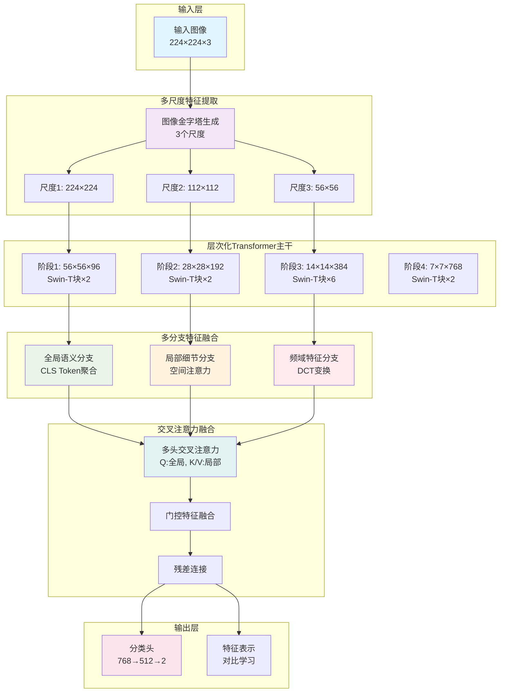

---
tags:
  - code
  - 计算机视觉
  - 人脸检测
  - 进阶
---
from:[[RINEPlusSSCA source code]]
# 🎯 多尺度层次化Transformer架构 (MS-HiT)

## 📊 整体架构图



## 🧩 核心设计思想

### 1. 多尺度金字塔输入
- **尺度1 (224×224)**: 高分辨率，保留细节信息
- **尺度2 (112×112)**: 中等分辨率，平衡计算和精度
- **尺度3 (56×56)**: 低分辨率，提取全局语义

### 2. 层次化Transformer设计
借鉴Swin-T的层次化结构，每个阶段都有不同的感受野：
- **阶段1**: 局部特征提取
- **阶段2**: 中等范围特征
- **阶段3**: 长距离依赖关系
- **阶段4**: 全局语义理解

### 3. 多分支特征融合
- **全局语义分支**: 关注整体图像内容
- **局部细节分支**: 捕捉纹理和边缘信息
- **频域特征分支**: 分析频率域特征模式

## 💻 代码实现

```python
import torch
import torch.nn as nn
import torch.nn.functional as F

class MultiScaleHierarchicalTransformer(nn.Module):
    """
    多尺度层次化Transformer架构
    
    设计理念：
    - 多尺度输入：处理不同分辨率的图像
    - 层次化特征：从局部到全局的特征提取
    - 多分支融合：结合语义、细节和频域信息
    """
    
    def __init__(self, num_classes=2, img_size=224, embed_dim=96, depths=[2, 2, 6, 2], 
                 num_heads=[3, 6, 12, 24], window_size=7, use_scales=[0.5, 0.25]):
        super().__init__()
        
        self.img_size = img_size
        self.use_scales = use_scales  # 多尺度比例 [0.5, 0.25]
        
        # ==================== 多尺度输入处理 ====================
        self.scale_encoders = nn.ModuleList()
        for scale in use_scales:
            encoder = SwinTransformerEncoder(
                img_size=int(img_size * scale),
                embed_dim=embed_dim,
                depths=depths,
                num_heads=num_heads,
                window_size=window_size
            )
            self.scale_encoders.append(encoder)
        
        # 原始尺度编码器
        self.original_encoder = SwinTransformerEncoder(
            img_size=img_size,
            embed_dim=embed_dim,
            depths=depths,
            num_heads=num_heads,
            window_size=window_size
        )
        
        # ==================== 多分支特征提取 ====================
        self.global_branch = GlobalSemanticBranch(embed_dim * 8)  # 阶段4输出维度
        self.local_branch = LocalDetailBranch(embed_dim * 4)     # 阶段3输出维度
        self.frequency_branch = FrequencyDomainBranch(embed_dim * 2)  # 阶段2输出维度
        
        # ==================== 交叉注意力融合 ====================
        self.cross_attention_fusion = CrossAttentionFusion(
            global_dim=embed_dim * 8,
            local_dim=embed_dim * 4,
            freq_dim=embed_dim * 2,
            out_dim=embed_dim * 8
        )
        
        # ==================== 输出头 ====================
        self.classifier = nn.Sequential(
            nn.LayerNorm(embed_dim * 8),
            nn.Linear(embed_dim * 8, 512),
            nn.GELU(),
            nn.Dropout(0.1),
            nn.Linear(512, num_classes)
        )
        
        self.feature_head = nn.Linear(embed_dim * 8, 512)  # 用于对比学习的特征表示
    
    def forward(self, x):
        """
        前向传播
        
        参数:
            x: 输入图像 [batch_size, 3, H, W]
        
        返回:
            logits: 分类logits [batch_size, num_classes]
            features: 特征表示 [batch_size, 512]
        """
        batch_size = x.shape[0]
        
        # ==================== 多尺度特征提取 ====================
        multi_scale_features = []
        
        # 原始尺度
        orig_features = self.original_encoder(x)
        multi_scale_features.append(orig_features)
        
        # 多尺度处理
        for i, scale in enumerate(self.use_scales):
            scaled_x = F.interpolate(x, scale_factor=scale, mode='bilinear', align_corners=False)
            scale_features = self.scale_encoders[i](scaled_x)
            scale_features = self._upsample_features(scale_features, orig_features[-1].shape[-2:])
            multi_scale_features.append(scale_features)
        
        # ==================== 多分支特征提取 ====================
        stage4_features = [feat[-1] for feat in multi_scale_features]  # 阶段4特征
        stage3_features = [feat[-2] for feat in multi_scale_features]  # 阶段3特征
        stage2_features = [feat[-3] for feat in multi_scale_features]  # 阶段2特征
        
        global_features = self.global_branch(stage4_features)
        local_features = self.local_branch(stage3_features)
        freq_features = self.frequency_branch(stage2_features)
        
        # ==================== 交叉注意力融合 ====================
        fused_features = self.cross_attention_fusion(
            global_features, local_features, freq_features
        )
        
        # ==================== 输出 ====================
        logits = self.classifier(fused_features)
        features = self.feature_head(fused_features)
        
        return logits, features
    
    def _upsample_features(self, features, target_size):
        """上采样特征到目标尺寸"""
        upsampled_features = []
        for feat in features:
            if feat.dim() == 4:  # 空间特征
                upsampled = F.interpolate(feat, size=target_size, mode='bilinear', align_corners=False)
            else:  # 序列特征
                upsampled = feat  # 保持原样
            upsampled_features.append(upsampled)
        return upsampled_features

class SwinTransformerEncoder(nn.Module):
    """简化的Swin Transformer编码器"""
    
    def __init__(self, img_size=224, embed_dim=96, depths=[2, 2, 6, 2], 
                 num_heads=[3, 6, 12, 24], window_size=7):
        super().__init__()
        
        self.stages = nn.ModuleList()
        
        # 阶段1: 56×56×96
        stage1 = nn.Sequential(*[
            SwinTransformerBlock(embed_dim, num_heads[0], window_size)
            for _ in range(depths[0])
        ])
        self.stages.append(stage1)
        
        # 阶段2: 28×28×192
        stage2 = nn.Sequential(*[
            SwinTransformerBlock(embed_dim * 2, num_heads[1], window_size)
            for _ in range(depths[1])
        ])
        self.stages.append(stage2)
        
        # 阶段3: 14×14×384
        stage3 = nn.Sequential(*[
            SwinTransformerBlock(embed_dim * 4, num_heads[2], window_size)
            for _ in range(depths[2])
        ])
        self.stages.append(stage3)
        
        # 阶段4: 7×7×768
        stage4 = nn.Sequential(*[
            SwinTransformerBlock(embed_dim * 8, num_heads[3], window_size)
            for _ in range(depths[3])
        ])
        self.stages.append(stage4)
    
    def forward(self, x):
        features = []
        current_x = x
        
        for stage in self.stages:
            current_x = stage(current_x)
            features.append(current_x)
        
        return features

class GlobalSemanticBranch(nn.Module):
    """全局语义分支 - 关注整体图像内容"""
    
    def __init__(self, dim):
        super().__init__()
        self.attention_pool = nn.AdaptiveAvgPool2d(1)
        self.proj = nn.Linear(dim, dim)
        
    def forward(self, features_list):
        pooled_features = []
        for feat in features_list:
            pooled = self.attention_pool(feat).view(feat.size(0), -1)
            pooled = self.proj(pooled)
            pooled_features.append(pooled)
        
        fused = torch.stack(pooled_features, dim=1).mean(dim=1)
        return fused

class LocalDetailBranch(nn.Module):
    """局部细节分支 - 空间注意力机制"""
    
    def __init__(self, dim):
        super().__init__()
        self.spatial_attention = SpatialAttention(dim)
        
    def forward(self, features_list):
        attended_features = []
        for feat in features_list:
            attended = self.spatial_attention(feat)
            pooled = F.adaptive_avg_pool2d(attended, 1).view(attended.size(0), -1)
            attended_features.append(pooled)
        
        fused = torch.stack(attended_features, dim=1).mean(dim=1)
        return fused

class FrequencyDomainBranch(nn.Module):
    """频域特征分支 - DCT变换分析"""
    
    def __init__(self, dim):
        super().__init__()
        self.dct_layer = DCTLayer()
        self.freq_proj = nn.Linear(dim, dim)
        
    def forward(self, features_list):
        freq_features = []
        for feat in features_list:
            freq_feat = self.dct_layer(feat)
            proj_feat = self.freq_proj(freq_feat.view(freq_feat.size(0), -1))
            freq_features.append(proj_feat)
        
        fused = torch.stack(freq_features, dim=1).mean(dim=1)
        return fused

class CrossAttentionFusion(nn.Module):
    """交叉注意力融合模块"""
    
    def __init__(self, global_dim, local_dim, freq_dim, out_dim):
        super().__init__()
        
        self.global_proj = nn.Linear(global_dim, out_dim)
        self.local_proj = nn.Linear(local_dim, out_dim)
        self.freq_proj = nn.Linear(freq_dim, out_dim)
        
        self.cross_attn = nn.MultiheadAttention(out_dim, num_heads=8, batch_first=True)
        
        self.gate = nn.Sequential(
            nn.Linear(out_dim * 3, out_dim),
            nn.Sigmoid()
        )
        
    def forward(self, global_feat, local_feat, freq_feat):
        q = self.global_proj(global_feat).unsqueeze(1)  # [B, 1, D]
        k = self.local_proj(local_feat).unsqueeze(1)    # [B, 1, D]
        v = self.freq_proj(freq_feat).unsqueeze(1)      # [B, 1, D]
        
        attended, _ = self.cross_attn(q, k, v)
        attended = attended.squeeze(1)
        
        concat_features = torch.cat([global_feat, local_feat, freq_feat], dim=1)
        gate_weights = self.gate(concat_features)
        
        fused = gate_weights * attended + (1 - gate_weights) * global_feat
        
        return fused

# 辅助组件定义
class SwinTransformerBlock(nn.Module):
    """简化的Swin Transformer块"""
    def __init__(self, dim, num_heads, window_size):
        super().__init__()
        self.norm1 = nn.LayerNorm(dim)
        self.attn = nn.MultiheadAttention(dim, num_heads, batch_first=True)
        self.norm2 = nn.LayerNorm(dim)
        self.mlp = nn.Sequential(
            nn.Linear(dim, dim * 4),
            nn.GELU(),
            nn.Linear(dim * 4, dim)
        )
    
    def forward(self, x):
        # 简化实现
        x = x + self.attn(self.norm1(x), self.norm1(x), self.norm1(x))[0]
        x = x + self.mlp(self.norm2(x))
        return x

class SpatialAttention(nn.Module):
    """空间注意力模块"""
    def __init__(self, dim):
        super().__init__()
        self.conv = nn.Conv2d(dim, dim, 3, padding=1)
        self.sigmoid = nn.Sigmoid()
    
    def forward(self, x):
        attention = self.sigmoid(self.conv(x))
        return x * attention

class DCTLayer(nn.Module):
    """DCT频域变换层"""
    def __init__(self):
        super().__init__()
    
    def forward(self, x):
        # 简化实现
        return torch.fft.rfft2(x, norm='ortho').abs()

# 测试代码
def test_model():
    model = MultiScaleHierarchicalTransformer(num_classes=2)
    x = torch.randn(2, 3, 224, 224)
    logits, features = model(x)
    print(f"输入形状: {x.shape}")
    print(f"分类输出: {logits.shape}")
    print(f"特征表示: {features.shape}")
    print(f"模型参数量: {sum(p.numel() for p in model.parameters()):,}")

if __name__ == "__main__":
    test_model()
```

## 🔗 相关概念链接

- [[金字塔和特征金字塔笔记]] - 多尺度处理基础
- [[Swan-T]] - 层次化Transformer设计
- [[RINEPlusSSCA source code]] - 多分支融合应用
- [[双分支写法]] - 双分支架构设计
- [[Vision Transformer (ViT) 模型详解]] - Transformer基础

## 🎯 应用场景

- **深度伪造检测**: 多尺度特征有助于捕捉不同粒度的伪造痕迹
- **人脸防伪**: 结合全局语义和局部细节提高检测精度
- **图像分类**: 多分支融合增强特征表示能力
- **目标检测**: 层次化特征适合多尺度目标检测

## 💡 创新点总结

1. **多尺度金字塔输入**: 同时处理不同分辨率的图像
2. **层次化Transformer**: 从局部到全局的特征提取
3. **多分支特征融合**: 语义、细节、频域信息互补
4. **交叉注意力融合**: 自适应特征权重分配
5. **门控融合机制**: 动态调整各分支贡献度

