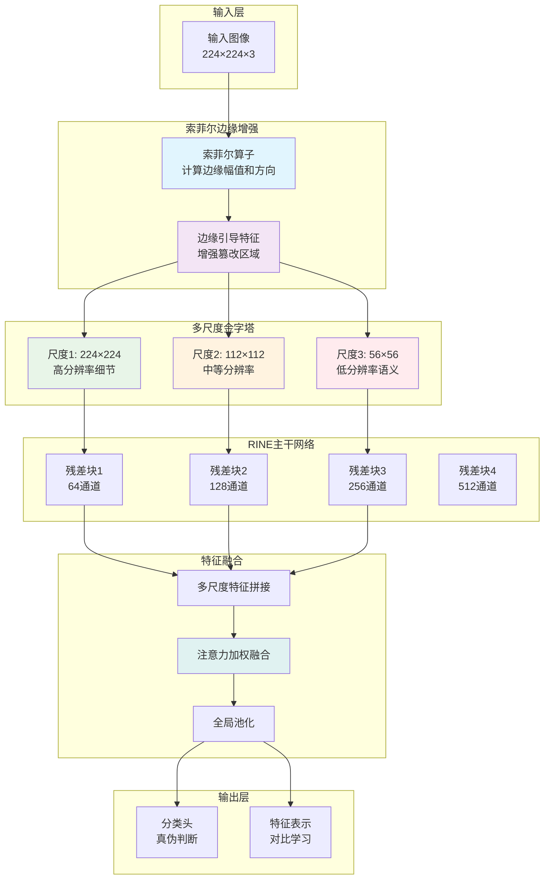

---
tags:
  - code
  - 计算机视觉
  - 人脸检测
  - 进阶
---
---

tags:
  - code
  - 计算机视觉
  - 人脸检测
  - 索菲尔算子
  - 多尺度金字塔
---
from:[[改进版RINEPlusSSCA]]
from:[[索菲尔算子笔记]]

# 🎯 索菲尔增强的多尺度金字塔RINE架构

## 📊 整体架构图



## 💻 完整代码实现

```python
import torch
import torch.nn as nn
import torch.nn.functional as F
import math

class SobelEnhancedRINE(nn.Module):
    """
    索菲尔增强的多尺度金字塔RINE架构
    
    设计理念：
    - 索菲尔边缘增强：突出篡改边界特征
    - 多尺度金字塔：捕捉不同粒度的伪造痕迹
    - RINE残差网络：稳定的特征提取
    - 注意力融合：自适应特征权重分配
    """
    
    def __init__(self, num_classes=2, img_size=224, base_channels=64, 
                 pyramid_scales=[1.0, 0.5, 0.25], use_sobel=True):
        super().__init__()
        
        self.img_size = img_size
        self.pyramid_scales = pyramid_scales
        self.use_sobel = use_sobel
        
        # ==================== 索菲尔边缘增强 ====================
        if use_sobel:
            self.sobel_enhancer = SobelEdgeEnhancer()
        
        # ==================== 多尺度特征提取 ====================
        self.pyramid_encoders = nn.ModuleList()
        for scale in pyramid_scales:
            encoder = RINEEncoder(
                in_channels=3,
                base_channels=base_channels,
                num_blocks=[2, 2, 2, 2],
                scale_factor=scale
            )
            self.pyramid_encoders.append(encoder)
        
        # ==================== 特征融合模块 ====================
        self.feature_fusion = MultiScaleFusion(
            channel_list=[base_channels * 8, base_channels * 4, base_channels * 2],
            out_channels=base_channels * 8
        )
        
        # ==================== 输出头 ====================
        self.classifier = nn.Sequential(
            nn.AdaptiveAvgPool2d(1),
            nn.Flatten(),
            nn.Linear(base_channels * 8, 512),
            nn.BatchNorm1d(512),
            nn.ReLU(inplace=True),
            nn.Dropout(0.3),
            nn.Linear(512, num_classes)
        )
        
        self.feature_head = nn.Sequential(
            nn.AdaptiveAvgPool2d(1),
            nn.Flatten(),
            nn.Linear(base_channels * 8, 512),
            nn.BatchNorm1d(512),
            nn.ReLU(inplace=True)
        )
    
    def forward(self, x):
        """
        前向传播
        
        参数:
            x: 输入图像 [batch_size, 3, H, W]
        
        返回:
            logits: 分类logits [batch_size, num_classes]
            features: 特征表示 [batch_size, 512]
            edge_maps: 边缘特征图 [可选]
        """
        batch_size = x.shape[0]
        
        # ==================== 索菲尔边缘增强 ====================
        if self.use_sobel:
            edge_enhanced = self.sobel_enhancer(x)
            # 原始图像 + 边缘增强特征
            enhanced_input = x + 0.3 * edge_enhanced
        else:
            enhanced_input = x
        
        # ==================== 多尺度特征提取 ====================
        multi_scale_features = []
        
        for i, (scale, encoder) in enumerate(zip(self.pyramid_scales, self.pyramid_encoders)):
            if scale == 1.0:
                # 原始尺度
                scale_input = enhanced_input
            else:
                # 缩放尺度
                target_size = (int(self.img_size * scale), int(self.img_size * scale))
                scale_input = F.interpolate(enhanced_input, size=target_size, 
                                          mode='bilinear', align_corners=False)
            
            # 提取特征
            scale_features = encoder(scale_input)
            multi_scale_features.append(scale_features)
        
        # ==================== 多尺度特征融合 ====================
        fused_features = self.feature_fusion(multi_scale_features)
        
        # ==================== 输出 ====================
        logits = self.classifier(fused_features)
        features = self.feature_head(fused_features)
        
        if self.use_sobel:
            edge_maps = self.sobel_enhancer.get_edge_maps(x)
            return logits, features, edge_maps
        else:
            return logits, features

class SobelEdgeEnhancer(nn.Module):
    """索菲尔边缘增强模块"""
    
    def __init__(self, kernel_size=3, sigma=1.0):
        super().__init__()
        
        # 索菲尔卷积核
        self.sobel_x, self.sobel_y = self._create_sobel_kernels(kernel_size)
        
        # 高斯平滑（可选）
        self.gaussian_blur = GaussianBlur(sigma=sigma)
        
        # 边缘增强卷积
        self.edge_conv = nn.Sequential(
            nn.Conv2d(3, 32, 3, padding=1),
            nn.ReLU(inplace=True),
            nn.Conv2d(32, 3, 3, padding=1),
            nn.Sigmoid()
        )
    
    def _create_sobel_kernels(self, kernel_size):
        """创建索菲尔卷积核"""
        if kernel_size == 3:
            sobel_x = torch.tensor([[-1, 0, 1],
                                   [-2, 0, 2], 
                                   [-1, 0, 1]], dtype=torch.float32).view(1, 1, 3, 3)
            sobel_y = torch.tensor([[-1, -2, -1],
                                   [0, 0, 0],
                                   [1, 2, 1]], dtype=torch.float32).view(1, 1, 3, 3)
        else:
            # 支持其他核尺寸
            sobel_x, sobel_y = self._create_general_sobel(kernel_size)
        
        return nn.Parameter(sobel_x, requires_grad=False), nn.Parameter(sobel_y, requires_grad=False)
    
    def _create_general_sobel(self, kernel_size):
        """创建通用索菲尔核"""
        kernel = torch.zeros(kernel_size, kernel_size)
        center = kernel_size // 2
        
        for i in range(kernel_size):
            for j in range(kernel_size):
                dx = j - center
                dy = i - center
                kernel[i, j] = dx / (dx*dx + dy*dy + 1e-6)
        
        sobel_x = kernel.unsqueeze(0).unsqueeze(0)
        sobel_y = kernel.t().unsqueeze(0).unsqueeze(0)
        return sobel_x, sobel_y
    
    def forward(self, x):
        """边缘增强前向传播"""
        batch_size, channels, height, width = x.shape
        
        # 高斯平滑（减少噪声）
        smoothed = self.gaussian_blur(x)
        
        # 计算梯度幅值
        gradient_maps = []
        for c in range(channels):
            channel_data = smoothed[:, c:c+1, :, :]
            
            # 索菲尔卷积
            grad_x = F.conv2d(channel_data, self.sobel_x, padding=1)
            grad_y = F.conv2d(channel_data, self.sobel_y, padding=1)
            
            # 梯度幅值
            magnitude = torch.sqrt(grad_x**2 + grad_y**2 + 1e-6)
            gradient_maps.append(magnitude)
        
        # 合并通道梯度
        edge_magnitude = torch.cat(gradient_maps, dim=1)
        
        # 归一化
        edge_magnitude = edge_magnitude / (edge_magnitude.max() + 1e-6)
        
        # 边缘增强
        enhanced_edges = self.edge_conv(edge_magnitude)
        
        return enhanced_edges
    
    def get_edge_maps(self, x):
        """获取边缘特征图（用于可视化）"""
        with torch.no_grad():
            batch_size, channels, height, width = x.shape
            edge_maps = []
            
            for c in range(channels):
                channel_data = x[:, c:c+1, :, :]
                grad_x = F.conv2d(channel_data, self.sobel_x, padding=1)
                grad_y = F.conv2d(channel_data, self.sobel_y, padding=1)
                magnitude = torch.sqrt(grad_x**2 + grad_y**2 + 1e-6)
                edge_maps.append(magnitude)
            
            return torch.cat(edge_maps, dim=1)

class RINEEncoder(nn.Module):
    """RINE残差编码器"""
    
    def __init__(self, in_channels=3, base_channels=64, num_blocks=[2, 2, 2, 2], scale_factor=1.0):
        super().__init__()
        
        self.scale_factor = scale_factor
        
        # 初始卷积层
        self.stem = nn.Sequential(
            nn.Conv2d(in_channels, base_channels, 7, stride=2, padding=3),
            nn.BatchNorm2d(base_channels),
            nn.ReLU(inplace=True),
            nn.MaxPool2d(3, stride=2, padding=1)
        )
        
        # 残差阶段
        self.stage1 = self._make_stage(base_channels, base_channels, num_blocks[0])
        self.stage2 = self._make_stage(base_channels, base_channels * 2, num_blocks[1], stride=2)
        self.stage3 = self._make_stage(base_channels * 2, base_channels * 4, num_blocks[2], stride=2)
        self.stage4 = self._make_stage(base_channels * 4, base_channels * 8, num_blocks[3], stride=2)
    
    def _make_stage(self, in_channels, out_channels, num_blocks, stride=1):
        """创建残差阶段"""
        layers = []
        
        # 第一个块处理下采样
        layers.append(ResidualBlock(in_channels, out_channels, stride))
        
        # 后续块
        for _ in range(1, num_blocks):
            layers.append(ResidualBlock(out_channels, out_channels))
        
        return nn.Sequential(*layers)
    
    def forward(self, x):
        # Stem
        x = self.stem(x)
        
        # 残差阶段
        x1 = self.stage1(x)  # /4
        x2 = self.stage2(x1) # /8
        x3 = self.stage3(x2) # /16
        x4 = self.stage4(x3) # /32
        
        return x4  # 返回最终特征图

class ResidualBlock(nn.Module):
    """残差块"""
    
    def __init__(self, in_channels, out_channels, stride=1):
        super().__init__()
        
        self.conv1 = nn.Conv2d(in_channels, out_channels, 3, stride, padding=1, bias=False)
        self.bn1 = nn.BatchNorm2d(out_channels)
        self.relu = nn.ReLU(inplace=True)
        self.conv2 = nn.Conv2d(out_channels, out_channels, 3, padding=1, bias=False)
        self.bn2 = nn.BatchNorm2d(out_channels)
        
        # 捷径连接
        self.shortcut = nn.Sequential()
        if stride != 1 or in_channels != out_channels:
            self.shortcut = nn.Sequential(
                nn.Conv2d(in_channels, out_channels, 1, stride, bias=False),
                nn.BatchNorm2d(out_channels)
            )
    
    def forward(self, x):
        residual = x
        
        out = self.conv1(x)
        out = self.bn1(out)
        out = self.relu(out)
        
        out = self.conv2(out)
        out = self.bn2(out)
        
        out += self.shortcut(residual)
        out = self.relu(out)
        
        return out

class MultiScaleFusion(nn.Module):
    """多尺度特征融合模块"""
    
    def __init__(self, channel_list, out_channels):
        super().__init__()
        
        self.channel_list = channel_list
        self.num_scales = len(channel_list)
        
        # 特征投影层
        self.projections = nn.ModuleList()
        for channels in channel_list:
            proj = nn.Sequential(
                nn.Conv2d(channels, out_channels, 1),
                nn.BatchNorm2d(out_channels),
                nn.ReLU(inplace=True)
            )
            self.projections.append(proj)
        
        # 空间注意力
        self.spatial_attention = SpatialAttention(out_channels)
        
        # 通道注意力
        self.channel_attention = ChannelAttention(out_channels)
    
    def forward(self, features_list):
        """
        融合多尺度特征
        
        参数:
            features_list: 多尺度特征列表 [feat1, feat2, feat3]
        """
        batch_size = features_list[0].shape[0]
        
        # 上采样到最大尺度
        target_size = features_list[0].shape[-2:]
        aligned_features = []
        
        for i, feat in enumerate(features_list):
            # 投影到统一维度
            proj_feat = self.projections[i](feat)
            
            # 上采样到目标尺寸
            if proj_feat.shape[-2:] != target_size:
                proj_feat = F.interpolate(proj_feat, size=target_size, 
                                        mode='bilinear', align_corners=False)
            
            aligned_features.append(proj_feat)
        
        # 特征拼接
        concat_features = torch.cat(aligned_features, dim=1)
        
        # 空间注意力
        spatial_weights = self.spatial_attention(concat_features)
        
        # 通道注意力
        channel_weights = self.channel_attention(concat_features)
        
        # 加权融合
        weighted_features = []
        for i, feat in enumerate(aligned_features):
            weighted = feat * spatial_weights * channel_weights[:, i:i+1, :, :]
            weighted_features.append(weighted)
        
        # 最终融合
        fused = torch.stack(weighted_features, dim=1).mean(dim=1)
        
        return fused

class SpatialAttention(nn.Module):
    """空间注意力模块"""
    
    def __init__(self, in_channels):
        super().__init__()
        
        self.conv = nn.Sequential(
            nn.Conv2d(in_channels * 3, in_channels, 3, padding=1),
            nn.BatchNorm2d(in_channels),
            nn.ReLU(inplace=True),
            nn.Conv2d(in_channels, 1, 1),
            nn.Sigmoid()
        )
    
    def forward(self, x):
        attention = self.conv(x)
        return attention

class ChannelAttention(nn.Module):
    """通道注意力模块"""
    
    def __init__(self, in_channels):
        super().__init__()
        
        self.avg_pool = nn.AdaptiveAvgPool2d(1)
        self.fc = nn.Sequential(
            nn.Linear(in_channels * 3, in_channels * 3 // 16),
            nn.ReLU(inplace=True),
            nn.Linear(in_channels * 3 // 16, 3),  # 3个尺度
            nn.Softmax(dim=1)
        )
    
    def forward(self, x):
        batch_size, channels, height, width = x.shape
        
        # 全局平均池化
        gap = self.avg_pool(x).view(batch_size, channels)
        
        # 通道权重
        weights = self.fc(gap).view(batch_size, 3, 1, 1)
        
        return weights

class GaussianBlur(nn.Module):
    """高斯模糊层"""
    
    def __init__(self, sigma