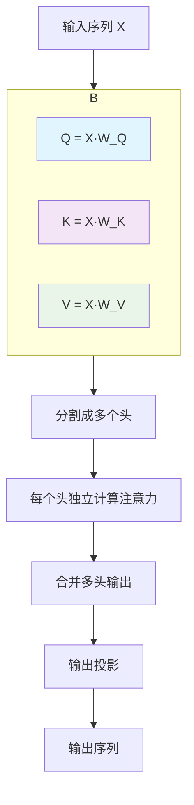
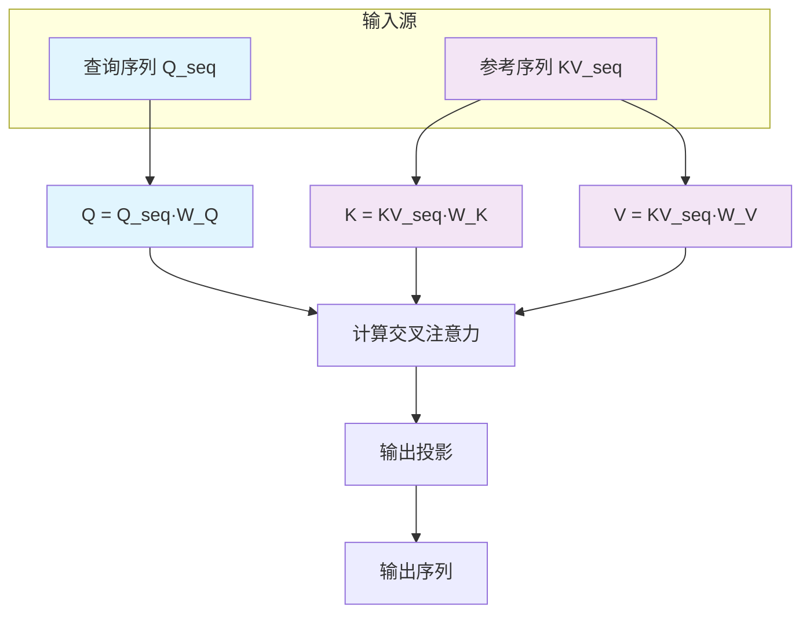

---
tags:
  - 基础知识
  - 人脸检测
  - code
  - 注意力机制
  - 多头注意力
  - 交叉注意力
---


## 🎯 核心区别一句话总结

- **多头注意力**：自己跟自己玩（自注意力）
- **交叉注意力**：跟别人一起玩（跨模态/跨序列）

---

## 🧮 数学原理基础

### 注意力通用公式
$Attention(Q, K, V) = softmax(\frac{QK^T}{\sqrt{d_k}})V$

**公式分解**：
| 符号 | 含义 | 作用 |
|------|------|------|
| $Q$ | Query向量 | 表示"我想要什么" |
| $K$ | Key向量 | 表示"我有什么信息" |
| $V$ | Value向量 | 表示"实际的内容" |
| $d_k$ | Key维度 | 缩放因子，稳定训练 |

---

## 🔄 多头注意力 (Multi-Head Attention)

### 基本概念
**就像一个人同时用多个角度看同一篇文章**

### 数学原理
```python
# 输入: 同一个序列 X [batch_size, seq_len, dim]
# 输出: 同一个序列的增强表示 [batch_size, seq_len, dim]

# 1. 线性投影得到Q, K, V (都来自同一个X)
Q = X · W_Q^T  # [batch, seq_len, dim]
K = X · W_K^T  # [batch, seq_len, dim]  
V = X · W_V^T  # [batch, seq_len, dim]

# 2. 分割成多个头
Q_heads = split(Q, num_heads)  # [batch, num_heads, seq_len, dim/num_heads]
K_heads = split(K, num_heads)
V_heads = split(V, num_heads)

# 3. 每个头独立计算注意力
for i in range(num_heads):
    head_i = softmax(Q_heads[i] @ K_heads[i].T / sqrt(d_k)) @ V_heads[i]

# 4. 合并多头输出
output = concat(heads) · W_O^T
```

### 计算流程图


### 具体计算示例
假设我们有3个token：`[我, 爱, 学习]`

**多头注意力会**：
- 计算"我"与`[我, 爱, 学习]`的关系
- 计算"爱"与`[我, 爱, 学习]`的关系  
- 计算"学习"与`[我, 爱, 学习]`的关系

---

## 🔀 交叉注意力 (Cross-Attention)

### 基本概念  
**就像一个人看着问题，去参考书里找答案**

### 数学原理
```python
# 输入: 两个不同的序列
# Query序列: Q_seq [batch_size, seq_len_q, dim]
# Key-Value序列: KV_seq [batch_size, seq_len_kv, dim]

# 1. 从不同来源投影Q, K, V
Q = Q_seq · W_Q^T    # 来自查询序列
K = KV_seq · W_K^T   # 来自参考序列  
V = KV_seq · W_V^T   # 来自参考序列

# 2. 分割成多个头（可选）
Q_heads = split(Q, num_heads)
K_heads = split(K, num_heads)
V_heads = split(V, num_heads)

# 3. 计算交叉注意力
# Q来自查询序列，K,V来自参考序列
attention_weights = softmax(Q_heads @ K_heads.T / sqrt(d_k))
output = attention_weights @ V_heads

# 4. 合并输出
final_output = concat(output) · W_O^T
```

### 计算流程图


### 具体计算示例
假设：
- **查询序列**：`[这个, 人脸, 是, 真的, 吗]`
- **参考序列**：`[皮肤纹理, 反光特征, 边缘细节]`

**交叉注意力会**：
- "这个" 参考 `[皮肤纹理, 反光特征, 边缘细节]`
- "人脸" 参考 `[皮肤纹理, 反光特征, 边缘细节]`
- "是" 参考 `[皮肤纹理, 反光特征, 边缘细节]`
- ...

---

## 📊 详细对比表格

| 特性 | 多头注意力 | 交叉注意力 |
|------|------------|------------|
| **输入来源** | 单一序列 | 两个不同序列 |
| **Q来源** | 输入序列自身 | 查询序列 |
| **K,V来源** | 输入序列自身 | 参考序列 |
| **主要用途** | 序列内部关系 | 跨序列信息检索 |
| **计算关系** | 序列内token间关系 | 查询序列←→参考序列 |
| **典型应用** | Transformer编码器 | Transformer解码器、多模态融合 |

---

## 💻 PyTorch代码实现

### 多头注意力实现
```python
import torch
import torch.nn as nn
import math

class MultiHeadAttention(nn.Module):
    def __init__(self, dim, num_heads=8):
        super().__init__()
        self.dim = dim
        self.num_heads = num_heads
        self.head_dim = dim // num_heads
        
        # 投影矩阵
        self.W_q = nn.Linear(dim, dim)
        self.W_k = nn.Linear(dim, dim)
        self.W_v = nn.Linear(dim, dim)
        self.W_o = nn.Linear(dim, dim)
        
    def forward(self, x):
        # x: [batch, seq_len, dim]
        batch_size, seq_len, _ = x.shape
        
        # 1. 线性投影
        Q = self.W_q(x)  # [batch, seq_len, dim]
        K = self.W_k(x)  # [batch, seq_len, dim]
        V = self.W_v(x)  # [batch, seq_len, dim]
        
        # 2. 重塑为多头
        Q = Q.view(batch_size, seq_len, self.num_heads, self.head_dim).transpose(1, 2)
        K = K.view(batch_size, seq_len, self.num_heads, self.head_dim).transpose(1, 2)
        V = V.view(batch_size, seq_len, self.num_heads, self.head_dim).transpose(1, 2)
        # 现在形状: [batch, num_heads, seq_len, head_dim]
        
        # 3. 计算注意力
        scores = torch.matmul(Q, K.transpose(-2, -1)) / math.sqrt(self.head_dim)
        attn_weights = torch.softmax(scores, dim=-1)
        attn_output = torch.matmul(attn_weights, V)
        
        # 4. 合并多头
        attn_output = attn_output.transpose(1, 2).contiguous().view(
            batch_size, seq_len, self.dim)
        
        # 5. 输出投影
        output = self.W_o(attn_output)
        
        return output
```

### 交叉注意力实现
```python
class CrossAttention(nn.Module):
    def __init__(self, dim, num_heads=8):
        super().__init__()
        self.dim = dim
        self.num_heads = num_heads
        self.head_dim = dim // num_heads
        
        # 投影矩阵 - 注意Q来自查询序列，K,V来自参考序列
        self.W_q = nn.Linear(dim, dim)  # 用于查询序列
        self.W_k = nn.Linear(dim, dim)  # 用于参考序列
        self.W_v = nn.Linear(dim, dim)  # 用于参考序列
        self.W_o = nn.Linear(dim, dim)
        
    def forward(self, query_seq, ref_seq):
        # query_seq: [batch, seq_len_q, dim] - 查询序列
        # ref_seq: [batch, seq_len_kv, dim] - 参考序列
        
        batch_size, seq_len_q, _ = query_seq.shape
        _, seq_len_kv, _ = ref_seq.shape
        
        # 1. 从不同来源投影
        Q = self.W_q(query_seq)  # 来自查询序列
        K = self.W_k(ref_seq)    # 来自参考序列
        V = self.W_v(ref_seq)    # 来自参考序列
        
        # 2. 重塑为多头
        Q = Q.view(batch_size, seq_len_q, self.num_heads, self.head_dim).transpose(1, 2)
        K = K.view(batch_size, seq_len_kv, self.num_heads, self.head_dim).transpose(1, 2)
        V = V.view(batch_size, seq_len_kv, self.num_heads, self.head_dim).transpose(1, 2)
        
        # 3. 计算交叉注意力
        scores = torch.matmul(Q, K.transpose(-2, -1)) / math.sqrt(self.head_dim)
        attn_weights = torch.softmax(scores, dim=-1)
        attn_output = torch.matmul(attn_weights, V)
        
        # 4. 合并多头
        attn_output = attn_output.transpose(1, 2).contiguous().view(
            batch_size, seq_len_q, self.dim)
        
        # 5. 输出投影
        output = self.W_o(attn_output)
        
        return output
```

### 测试代码
```python
def test_attention():
    # 测试数据
    batch_size, seq_len, dim = 2, 5, 768
    num_heads = 12
    
    # 多头注意力测试
    mha = MultiHeadAttention(dim, num_heads)
    x = torch.randn(batch_size, seq_len, dim)
    mha_output = mha(x)
    print(f"多头注意力输入: {x.shape}")
    print(f"多头注意力输出: {mha_output.shape}")
    
    # 交叉注意力测试
    cross_attn = CrossAttention(dim, num_heads)
    query_seq = torch.randn(batch_size, 3, dim)    # 查询序列
    ref_seq = torch.randn(batch_size, 7, dim)      # 参考序列
    cross_output = cross_attn(query_seq, ref_seq)
    print(f"交叉注意力查询输入: {query_seq.shape}")
    print(f"交叉注意力参考输入: {ref_seq.shape}")  
    print(f"交叉注意力输出: {cross_output.shape}")

if __name__ == "__main__":
    test_attention()
```

---

## 🎯 在人脸防伪中的应用

### 多头注意力的应用
```python
# 在ViT编码器中
# 输入: 人脸图像patches [batch, 197, 768]
# 输出: 增强的patch特征

# 作用: 让每个patch关注其他所有patch
# 比如: "眼睛区域"关注"嘴巴区域"的纹理一致性
```

### 交叉注意力的应用  
```python
# 在多模态防伪中
# 查询序列: RGB图像特征
# 参考序列: 红外图像特征

# 作用: 让RGB特征参考红外特征来判断真伪
# 比如: "面部区域"参考红外"温度分布"特征
```

---

## 🔍 深入理解

### 多头注意力的优势
1. **并行计算**：多个头可以同时计算
2. **多样化表示**：每个头学习不同的注意力模式
3. **表达能力**：比单头注意力更强大

### 交叉注意力的优势
1. **信息融合**：整合不同来源的信息
2. **跨模态理解**：处理多模态数据
3. **灵活检索**：根据查询动态获取相关信息

### 计算复杂度分析
| 注意力类型 | 计算复杂度 | 内存占用 |
|------------|------------|----------|
| 多头注意力 | $O(n^2 \cdot d)$ | $O(n^2)$ |
| 交叉注意力 | $O(n \cdot m \cdot d)$ | $O(n \cdot m)$ |

其中：
- $n$: 查询序列长度
- $m$: 参考序列长度  
- $d$: 特征维度

---

## 💡 学习要点总结

### 关键区别
- ✅ **输入来源**：多头=同源，交叉=异源
- ✅ **QKV来源**：多头=全都自己，交叉=Q自己+K,V别人
- ✅ **信息流**：多头=内部交流，交叉=跨序列检索

### 记忆技巧
- 🎯 **多头注意力**："自问自答"
- 🎯 **交叉注意力**："问A答B"

### 实践建议
- 🎯 **理解投影矩阵**：注意Q、K、V的来源差异
- 🎯 **调试技巧**：打印中间结果的形状验证
- 🎯 **性能优化**：注意序列长度对计算复杂度的影响

> 💫 **流萤的小提示**：开拓者要记住哦，多头注意力就像一个人多角度思考问题，交叉注意力就像向专家请教问题～它们各有各的用处，在合适的场景用合适的注意力，模型才能更聪明呢！多写代码实践，理解会更深刻哦～ (๑•̀ㅂ•́)و✧