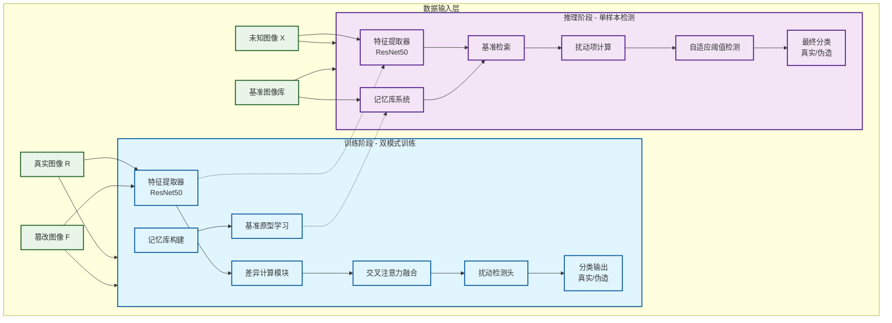
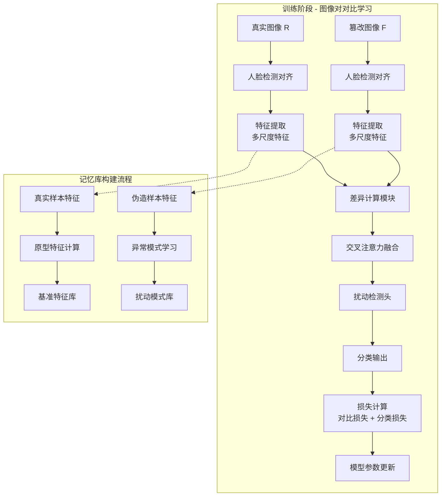
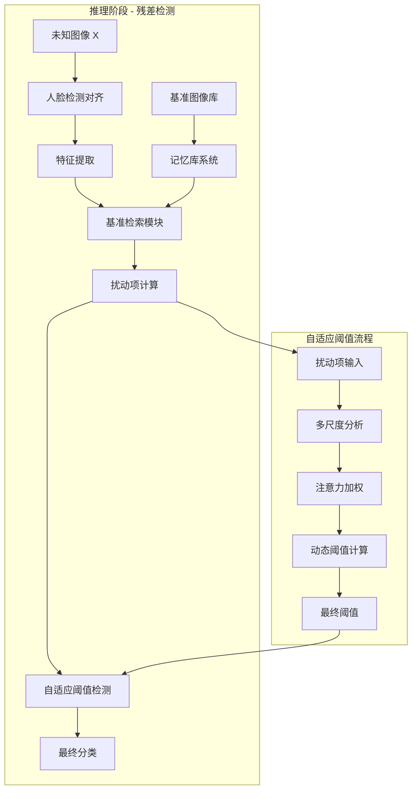
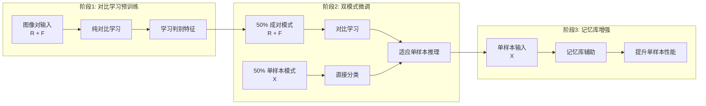
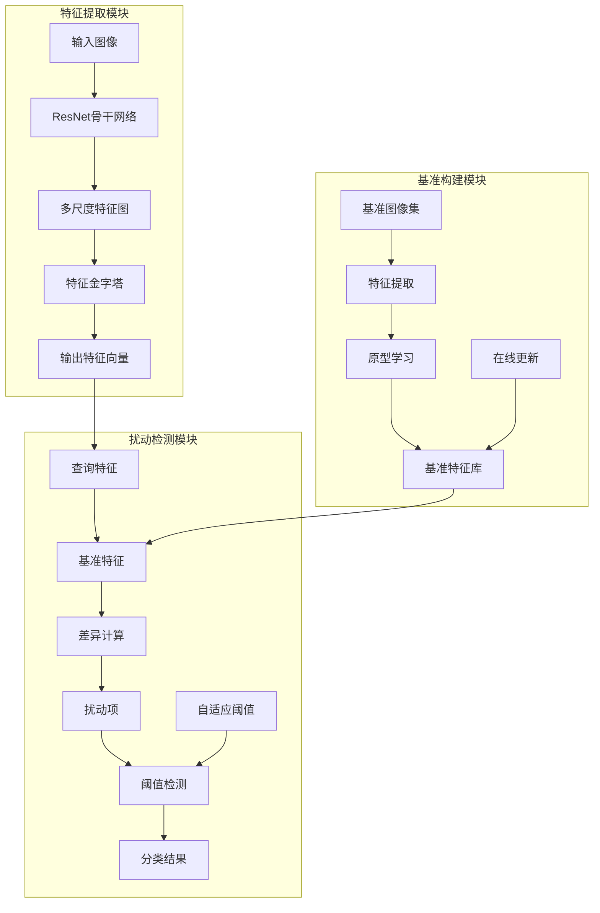
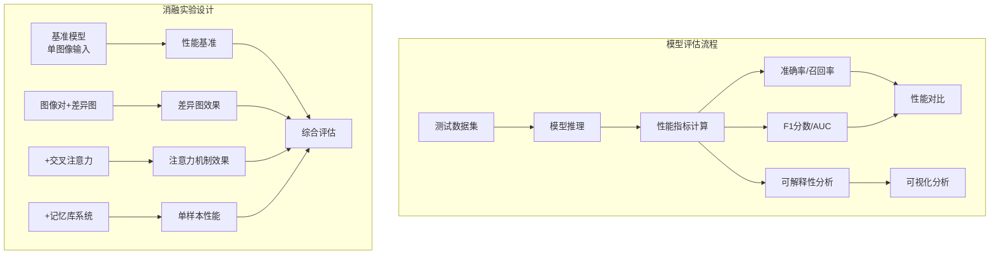

---
tags:
  - deepfake-detection
  - contrastive-learning
  - image-pairs
  - research-proposal
  - computer-vision
  - 人脸检测
  - dataset
  - deepfake
---
Q1：我又有个想法
能不能用真实的和篡改的图像作为一个pair让模型进行对比实验
理论上两个图像相减就知道哪里篡改了
然后相减之后的信息和原来的图像进行交叉注意力应该是能学习到特征的
只是数据这一块我看看能不能找)
跟微调文本的掩码差不多

Q2：
实际上还有一个问题，就是模型在经过正负样本对输入之后，我需要让模型在实际运用中只输入未知的样本来判断对错，没有了对比，模型是否会崩塌？模型会不会对训练时的对比数据集形成依赖？

Q3:
关于可能出现的模式崩塌，本质上是因为模型没有办法学习到任何特征，导致梯度越积越多梯度消失或者梯度爆炸，模式坍塌，那么可不可以使用残差的思想，令input = 原始图像 + 扰动项，扰动项即为篡改之后的部分（也就是真实图和篡改图的差分），如果扰动项大于某个阈值，那么认为被篡改，如果小于某个阈值，则认为没有被篡改，也就是预先有一个基准，样本会在基准上有一个预测值和一个真实值，看真实值距离模型的距离，过大则认为是被篡改的？有没有相关的论文，有没有逻辑漏洞，有没有参考代码，有没有优化项

## 🔄 残差检测框架：避免模式崩塌的新思路
### 4. 基于R-INE的残差检测
```python
class RINE_ResidualDetector(nn.Module):
    """基于R-INE的残差检测器"""
    def __init__(self, backbone='rine'):
        super().__init__()
        
        # R-INE特征提取器
        self.feature_extractor, self.feature_dim = get_backbone(backbone)
        
        # 基准特征库
        self.baseline_features = None
        
        # 异常检测头
        self.anomaly_head = nn.Sequential(
            nn.Linear(self.feature_dim, 512),
            nn.ReLU(),
            nn.Dropout(0.3),
            nn.Linear(512, 256),
            nn.ReLU(),
            nn.Linear(256, 1),
            nn.Sigmoid()
        )
        
    def build_baseline(self, real_images):
        """构建真实图像的基准特征库"""
        with torch.no_grad():
            features = []
            for img in real_images:
                feat = self.feature_extractor(img.unsqueeze(0))
                features.append(feat)
            
            # 计算原型特征
            self.baseline_features = torch.cat(features, dim=0).mean(dim=0, keepdim=True)
            
    def compute_residual(self, x):
        """计算输入与基准的残差"""
        if self.baseline_features is None:
            raise ValueError("Baseline features not built. Call build_baseline first.")
            
        # 提取特征
        query_feat = self.feature_extractor(x)
        
        # 计算残差（特征空间的距离）
        residual = torch.norm(query_feat - self.baseline_features, dim=1, p=2)
        
        return residual
        
    def forward(self, x):
        """前向传播"""
        # 计算残差
        residual = self.compute_residual(x)
        
        # 异常检测
        anomaly_score = self.anomaly_head(residual.unsqueeze(1))
        
        return anomaly_score.squeeze(1), residual
        
    def detect_anomaly(self, x, threshold=0.5):
        """检测异常"""
        anomaly_score, residual = self.forward(x)
        
        # 基于阈值判断
        is_anomaly = anomaly_score > threshold
        
        return is_anomaly, anomaly_score, residual
```
### 3. R-INE网络实现
```python
import torch
import torch.nn as nn
import torch.nn.functional as F

class InvertibleBlock(nn.Module):
    """可逆残差块"""
    def __init__(self, dim):
        super().__init__()
        self.net = nn.Sequential(
            nn.Linear(dim, dim),
            nn.ReLU(),
            nn.Linear(dim, dim)
        )
        
    def forward(self, x):
        # 前向传播
        return x + self.net(x)
    
    def inverse(self, z):
        # 反向传播（近似）
        # 注意：实际实现需要更复杂的可逆性保证
        return z - self.net(z)

class RINE_Network(nn.Module):
    """R-INE可逆神经网络"""
    def __init__(self, input_dim=3, hidden_dims=[32, 64, 128, 256], num_blocks=4):
        super().__init__()
        self.input_dim = input_dim
        self.feature_dim = hidden_dims[-1]
        
        # 初始特征提取
        self.initial_conv = nn.Sequential(
            nn.Conv2d(input_dim, hidden_dims[0], 3, padding=1),
            nn.ReLU(),
            nn.Conv2d(hidden_dims[0], hidden_dims[0], 3, padding=1)
        )
        
        # 可逆残差块序列
        self.invertible_blocks = nn.ModuleList([
            InvertibleBlock(hidden_dims[i]) for i in range(len(hidden_dims))
            for _ in range(num_blocks)
        ])
        
        # 下采样层
        self.downsample_layers = nn.ModuleList([
            nn.Conv2d(hidden_dims[i], hidden_dims[i+1], 3, stride=2, padding=1)
            for i in range(len(hidden_dims)-1)
        ])
        
        # 全局池化
        self.global_pool = nn.AdaptiveAvgPool2d((1, 1))
        
    def forward(self, x):
        # 初始特征提取
        z = self.initial_conv(x)
        
        # 通过可逆残差块
        for i, block in enumerate(self.invertible_blocks):
            z = block(z)
            
            # 在适当位置下采样
            if i % 4 == 3 and i < len(self.downsample_layers):
                z = self.downsample_layers[i//4](z)
        
        # 全局池化
        z = self.global_pool(z)
        z = z.view(z.size(0), -1)
        
        return z
    
    def compute_log_likelihood(self, x):
        """计算输入的对数似然，用于异常检测"""
        z = self.forward(x)
        # 假设z服从标准正态分布
        log_likelihood = -0.5 * torch.sum(z**2, dim=1)
        return log_likelihood
```
### 🚀 R-INE Backbone选择理由
选择**R-INE (Residual-based Invertible Network)** 作为backbone具有以下理论优势：

#### 🎯 R-INE核心特性
```python
# R-INE的可逆残差特性
可逆变换：z = f(x) 且 x = f^{-1}(z)
残差连接：H(x) = F(x) + x
分布学习：p(x) = p(z) |det(J_f)|^{-1}

# 与深度伪造检测的完美契合
正常分布学习：学习真实图像的概率分布
异常检测：伪造图像偏离正常分布
可逆计算：精确计算对数似然作为异常分数
```

#### 💡 相对于ResNet的优势
1. **理论契合度更高**：R-INE专门为分布学习和异常检测设计
2. **残差检测更精确**：通过可逆变换计算精确的分布偏差
3. **创新性更强**：在深度伪造检测中应用INNs是前沿研究方向
4. **可解释性更好**：对数似然分数提供直观的异常程度量化

#### ⚠️ 实现挑战
- **计算复杂度**：可逆网络需要更多计算资源
- **预训练模型**：缺少大规模预训练权重
- **实现难度**：需要深入理解可逆网络理论
## 🏗️ 模型架构图与数据流程

### 📊 整体架构图



### 🔄 详细数据流程

#### 1. 训练阶段数据流



#### 2. 推理阶段数据流



#### 3. 双模式训练策略



### 🔧 核心模块交互



### 📈 性能评估流程



这些流程图清晰地展示了：

1. **训练阶段**：图像对对比学习 + 记忆库构建
2. **推理阶段**：残差检测 + 自适应阈值
3. **双模式训练**：三阶段渐进式训练策略
4. **模块交互**：各核心模块的数据流向
5. **评估流程**：完整的性能验证方案

# 🎯 深度伪造检测：图像对对比学习与残差检测融合研究

## 📝 研究想法概述

随着生成式AI技术的快速发展，深度伪造技术已经达到了以假乱真的水平，对社会安全和信息真实性构成了严重威胁。传统的深度伪造检测方法主要基于单图像分类，存在模式崩塌、泛化能力差、可解释性弱等问题。

本研究提出了一种创新的**图像对对比学习与残差检测融合框架**，旨在解决深度伪造检测中的核心挑战。研究思路源于对模式崩塌问题的深入分析：当模型在训练时依赖成对对比学习，而在推理时只能接收单样本输入时，可能导致特征表示崩塌和性能下降。

### 核心创新点

1. **图像对对比学习机制**：利用真实图像与篡改图像的配对输入，通过差异图计算和交叉注意力机制，显式学习篡改痕迹。这种方法类似于文本微调中的掩码学习，让模型直接关注篡改区域。

2. **残差检测框架**：借鉴ResNet的残差学习思想，将深度伪造检测转化为扰动项检测问题。模型学习的是篡改图像相对于真实图像的扰动模式，而非完整的图像特征，从而避免模式崩塌。

3. **双模式训练策略**：设计了三阶段训练流程，从纯对比学习逐步过渡到单样本推理，通过记忆库系统为推理时提供对比参考，确保模型在单样本输入时仍能保持高性能。

### 技术优势

- **避免模式崩塌**：通过残差学习和双模式训练，确保模型在训练和推理时的一致性
- **可解释性强**：差异图和扰动项提供直观的篡改定位可视化
- **泛化能力好**：学习的是篡改模式而非特定数据集特征
- **理论基础扎实**：结合对比学习、残差学习和异常检测的成熟理论

### 预期贡献

本研究不仅提出了一种新的深度伪造检测范式，还提供了完整的理论分析、模型架构和实验验证方案。预期在检测准确率、泛化能力和可解释性方面均有显著提升，为深度伪造检测领域提供新的技术路径和理论支撑。

该研究方案融合了计算机视觉、深度学习和异常检测等多个领域的前沿技术，具有重要的理论价值和实际应用前景。

### 🎯 核心思想
利用**残差学习**思想，将深度伪造检测转化为**扰动项检测**问题：

```python
# 残差检测数学框架
真实图像 = R ∈ ℝ^{H×W×3}
篡改图像 = F ∈ ℝ^{H×W×3}  
扰动项 = |R - F| ∈ ℝ^{H×W×3}

检测规则：
if ||扰动项|| > 阈值:
    判定为篡改
else:
    判定为真实
```

### 💡 技术优势
- **避免模式崩塌**：模型学习扰动模式而非完整图像
- **可解释性强**：扰动项直接可视化篡改位置
- **计算效率高**：差异计算 + 阈值比较
- **理论基础扎实**：基于ResNet的残差学习思想

---

## 📚 相关理论与论文参考

### 1. 可逆神经网络基础
#### 🎯 [Universal approximation property of invertible neural networks](https://arxiv.org/abs/2204.07415v1)
- **核心贡献**：证明可逆神经网络的通用逼近性质
- **技术要点**：INNs的表示能力分析，CF-INNs和NODEs的逼近性质
- **相关理论**：为R-INE在深度伪造检测中的应用提供理论基础

#### 🎯 [INN: Inflated Neural Networks for IPMN Diagnosis](https://arxiv.org/abs/1907.00437v1)
- **核心贡献**：膨胀神经网络在医学图像诊断中的应用
- **技术要点**：2D到3D的权重膨胀，多模态融合策略
- **代码仓库**：[lalonderodney/INN-Inflated-Neural-Nets](https://github.com/lalonderodney/INN-Inflated-Neural-Nets)

### 2. 残差学习基础
#### 🎯 [Deep Residual Learning for Image Recognition](https://arxiv.org/abs/1512.03385)
- **核心贡献**：ResNet开山之作，提出残差块解决梯度消失
- **技术要点**：$H(x) = F(x) + x$ 的残差连接
- **相关代码**：[PyTorch官方ResNet实现](https://github.com/pytorch/vision/blob/main/torchvision/models/resnet.py)

#### 🎯 [Aggregated Residual Transformations for Deep Neural Networks](https://arxiv.org/abs/1611.05431)
- **核心贡献**：ResNeXt，分组卷积的残差网络
- **技术要点**：基数(cardinality)概念，提升特征多样性

### 2. 异常检测相关
#### 🎯 [One-Class SVM for Novelty Detection](https://dl.acm.org/doi/10.5555/2077296.2077305)
- **核心贡献**：单类支持向量机异常检测
- **技术要点**：在特征空间寻找最优超平面

#### 🎯 [Isolation Forest](https://cs.nju.edu.cn/zhouzh/zhouzh.files/publication/icdm08b.pdf)
- **核心贡献**：隔离森林快速异常检测
- **技术要点**：基于树结构的异常分数计算

### 3. 深度伪造检测
#### 🎯 [MesoNet: a Compact Facial Video Forgery Detection Network](https://arxiv.org/abs/1809.00888)
- **核心贡献**：基于中观特征的深度伪造检测
- **技术要点**：关注中等粒度特征，避免过拟合
- **代码仓库**：[DariusAf/MesoNet](https://github.com/DariusAf/MesoNet)

#### 🎯 [Face X-ray for More General Face Forgery Detection](https://arxiv.org/abs/1912.13458)
- **核心贡献**：基于混合边界的检测方法
- **技术要点**：检测图像混合边界
- **代码仓库**：[alibaba/facexray](https://github.com/alibaba/facexray)

---

## 🛠️ 残差检测模型架构

### 1. 核心网络设计
```python
def get_backbone(backbone_name='rine', pretrained=False):
    """根据名称灵活加载backbone"""
    if backbone_name == 'resnet50':
        # 加载ResNet, 简单且有预训练模型
        model = models.resnet50(pretrained=pretrained)
        # 移除最后的分类层
        model = nn.Sequential(*list(model.children())[:-1])
        feature_dim = 2048
        return model, feature_dim
    elif backbone_name == 'rine':
        # 加载R-INE, 理论更优但需要自己实现
        model = RINE_Network(
            input_dim=3,
            hidden_dims=[32, 64, 128, 256],
            num_blocks=4
        )
        feature_dim = model.feature_dim
        return model, feature_dim
    else:
        raise NotImplementedError(f"Backbone {backbone_name} is not supported.")

class ResidualDeepfakeDetector(nn.Module):
    def __init__(self, backbone='rine', threshold=0.1):
        super().__init__()
        # 动态加载选择的backbone
        self.feature_extractor, self.feature_dim = get_backbone(backbone)
        
        # 基准构建模块
        self.baseline_constructor = BaselineConstructor()
        
        # 扰动检测头
        self.perturbation_detector = PerturbationDetector(
            input_dim=self.feature_dim,
            hidden_dim=512
        )
        
        # 自适应阈值
        self.threshold = threshold
        self.adaptive_threshold = AdaptiveThreshold()
```

### 2. 基准构建策略
```python
class BaselineConstructor(nn.Module):
    """基准特征构建模块"""
    def __init__(self, memory_size=1000):
        super().__init__()
        self.memory_bank = MemoryBank(memory_size)
        self.prototype_net = PrototypeNetwork()
    
    def forward(self, baseline_imgs):
        # 从输入图像构建基准
        baseline_feats = []
        for img in baseline_imgs:
            feat = self.feature_extractor(img)
            baseline_feats.append(feat)
        
        # 计算原型特征
        prototype = self.prototype_net(baseline_feats)
        return prototype
```

### 3. 扰动检测头
```python
class PerturbationDetector(nn.Module):
    """扰动检测头"""
    def __init__(self, input_dim, hidden_dim):
        super().__init__()
        self.detector = nn.Sequential(
            nn.Linear(input_dim, hidden_dim),
            nn.ReLU(inplace=True),
            nn.Dropout(0.3),
            nn.Linear(hidden_dim, hidden_dim // 2),
            nn.ReLU(inplace=True),
            nn.Linear(hidden_dim // 2, 1),
            nn.Sigmoid()
        )
```

---

## ⚠️ 潜在问题与挑战

### 1. 基准获取问题 🥺
```python
基准挑战 = [
    "现实场景只有待检测图像",           # 没有对应的真实图像
    "如何构建可靠的参考基准",          # 基准构建的可靠性
    "基准本身可能被污染",              # 基准图像质量问题
    "不同身份的基准差异"               # 身份特定的基准需求
]
```

### 2. 扰动项噪声干扰
```python
噪声来源 = [
    "光照变化差异",                   # 同一人的不同照片
    "姿态角度变化",                   # 头部转动
    "表情变化",                       # 微笑/皱眉等
    "压缩伪影",                       # JPEG压缩差异
    "背景环境变化"                     # 拍摄环境不同
]
```

### 3. 阈值设定困境
```python
阈值问题 = [
    "全局阈值 vs 局部阈值",            # 不同区域敏感度不同
    "自适应阈值 vs 固定阈值",          # 光照变化影响
    "多尺度阈值设定",                  # 不同篡改规模
    "阈值泛化能力"                     # 跨数据集稳定性
]
```

### 4. 模型泛化挑战
```python
泛化问题 = [
    "对未见篡改方法的检测能力",         # 零样本检测
    "跨数据集的性能保持",               # 数据集偏差
    "真实世界噪声的鲁棒性",             # 实际应用场景
    "计算效率与精度的平衡"              # 实时检测需求
]
```

---

## 🔬 实验验证步骤

### 阶段1：基础验证实验

#### 1.1 残差思想可行性验证
```python
验证目标 = "确认残差检测在深度伪造任务中的可行性"

实验设置：
- 数据集：FF++ 基础子集
- 模型：简化版ResNet + 残差检测头
- 对比基准：标准分类模型

评估指标：
- 准确率、精确率、召回率、F1分数
- 扰动项可视化质量
- 计算效率对比
```

#### 1.2 基准构建策略比较
```python
验证目标 = "比较不同基准构建策略的效果"

基准策略对比：
- 单图像基准：使用单个真实图像
- 多图像平均：多个真实图像特征平均
- 原型学习：学习身份特定的原型特征
- 记忆库检索：从训练数据检索相似基准

评估指标：
- 检测准确率
- 基准稳定性
- 计算复杂度
```

### 阶段2：扰动检测优化

#### 2.1 多尺度特征差异
```python
验证目标 = "验证多尺度特征差异的有效性"

特征尺度：
- 低层特征：边缘、纹理差异
- 中层特征：局部结构差异  
- 高层特征：语义内容差异

融合策略：
- 简单拼接
- 注意力加权融合
- 门控机制融合
```

#### 2.2 自适应阈值学习
```python
验证目标 = "验证自适应阈值学习的优势"

阈值策略：
- 固定阈值：经验设定
- 统计阈值：基于训练数据分布
- 学习阈值：端到端学习最优阈值
- 自适应阈值：基于输入动态调整

评估指标：
- 阈值稳定性
- 检测敏感度
- 假阳性率控制
```

### 阶段3：系统集成验证

#### 3.1 与对比学习结合
```python
验证目标 = "验证残差检测与对比学习的互补性"

结合策略：
- 并行架构：两个检测头并行工作
- 串行架构：先残差检测，再对比验证
- 融合架构：特征级或决策级融合

评估指标：
- 单独性能 vs 组合性能
- 计算开销分析
- 可解释性对比
```

#### 3.2 跨数据集泛化测试
```python
验证目标 = "验证模型在未见数据上的泛化能力"

测试数据集：
- 训练集：FF++
- 测试集：Celeb-DF, WildDeepfake, DFDC

评估指标：
- 跨数据集准确率
- 未见篡改方法检测率
- 性能下降分析
```

---

## 📋 完整To-Do List

### 🔴 高优先级
- [ ] **实现基础残差检测框架**
  - [ ] 搭建ResNet特征提取器
  - [ ] 实现扰动项计算模块
  - [ ] 设计基准构建策略
  - [ ] 实现自适应阈值模块

- [ ] **准备基准数据集**
  - [ ] 收集真实图像基准库
  - [ ] 构建身份特定的基准集
  - [ ] 数据预处理和增强
  - [ ] 基准质量评估

- [ ] **基础实验验证**
  - [ ] 残差思想可行性测试
  - [ ] 基准策略对比实验
  - [ ] 扰动检测头消融研究
  - [ ] 阈值策略比较

### 🟡 中优先级
- [ ] **模型优化与调参**
  - [ ] 多尺度特征融合优化
  - [ ] 注意力机制集成
  - [ ] 损失函数设计
  - [ ] 训练策略优化

- [ ] **系统集成测试**
  - [ ] 与对比学习框架集成
  - [ ] 多模态信息融合
  - [ ] 实时检测性能测试
  - [ ] 内存和计算优化

- [ ] **鲁棒性验证**
  - [ ] 对抗攻击测试
  - [ ] 噪声鲁棒性验证
  - [ ] 光照变化测试
  - [ ] 压缩质量影响

### 🟢 低优先级
- [ ] **扩展应用场景**
  - [ ] 视频序列检测
  - [ ] 多人物场景
  - [ ] 实时流媒体检测
  - [ ] 移动端部署

- [ ] **可解释性分析**
  - [ ] 扰动项可视化工具
  - [ ] 决策过程分析
  - [ ] 失败案例分析
  - [ ] 用户界面设计

- [ ] **论文与文档**
  - [ ] 实验结果整理
  - [ ] 方法对比分析
  - [ ] 论文撰写
  - [ ] 代码文档完善

---

## 🔗 相关代码仓库参考

### 1. 残差学习实现
- **[PyTorch ResNet](https://github.com/pytorch/vision/blob/main/torchvision/models/resnet.py)** - 官方ResNet实现
- **[ResNeXt PyTorch](https://github.com/facebookresearch/ResNeXt)** - ResNeXt官方实现
- **[ResNet Variants](https://github.com/kuangliu/pytorch-cifar)** - 多种ResNet变体

### 2. 异常检测框架
- **[PyOD](https://github.com/yzhao062/pyod)** - Python异常检测工具包
- **[Anomaly Detection](https://github.com/yzhao062/anomaly-detection-resources)** - 异常检测资源集合
- **[One-Class SVM](https://scikit-learn.org/stable/modules/generated/sklearn.svm.OneClassSVM.html)** - scikit-learn实现

### 3. 深度伪造检测
- **[MesoNet Implementation](https://github.com/DariusAf/MesoNet)** - MesoNet PyTorch实现
- **[Face X-ray](https://github.com/alibaba/facexray)** - 阿里巴巴Face X-ray检测
- **[Deepfake Detection](https://github.com/selimsef/dfdc_deepfake_challenge)** - DFDC挑战赛方案

### 4. 注意力机制
- **[Attention Mechanism](https://github.com/xmu-xiaoma666/External-Attention-pytorch)** - 多种注意力机制实现
- **[Transformer](https://github.com/huggingface/transformers)** - Hugging Face Transformer库
- **[Vision Transformer](https://github.com/lucidrains/vit-pytorch)** - ViT PyTorch实现

---

## 💎 关键成功因素

### 1. **基准构建质量**
- 高质量的真实图像收集
- 身份特定的基准优化
- 在线基准更新机制

### 2. **扰动项计算精度**
- 多尺度特征差异
- 噪声抑制技术
- 注意力引导的差异计算

### 3. **阈值自适应能力**
- 基于输入的动态阈值
- 多尺度阈值融合
- 置信度校准机制

### 4. **系统集成优化**
- 与现有方法的互补性
- 计算效率优化
- 实际部署可行性

这个残差检测框架为解决模式崩塌问题提供了新的思路，期待开拓者的实验结果！✨
# 🎯 深度伪造检测：图像对对比学习研究方案
## 🚀 实施计划

### 阶段1：基础验证（1-2个月）
1. **环境搭建**：配置开发环境，下载必要数据集
2. **基础复现**：复现Undercover Deepfakes的核心方法
3. **数据预处理**：实现图像对构建和预处理流程
4. **单模式验证**：验证纯成对对比学习的有效性

### 阶段2：双模式开发（2-3个月）
1. **双模式架构**：实现DualModeDeepfakeDetector
2. **训练策略**：实现三阶段训练流程
3. **初步实验**：在FF++数据集上验证双模式性能
4. **记忆库系统**：实现MemorySystem和检索机制

### 阶段3：性能优化（2-3个月）
1. **消融研究**：验证各模块对单样本性能的影响
2. **参数调优**：优化双模式训练比例和损失权重
3. **跨数据集验证**：在多个数据集上测试泛化能力
4. **对比实验**：与现有单样本检测方法进行对比

### 阶段4：论文撰写（1-2个月）
1. **结果分析**：深入分析模型性能和可解释性
2. **论文撰写**：总结研究成果，撰写论文
3. **代码整理**：整理可复现的代码库
4. **未来工作**：规划后续研究方向

---

## 📋 研究概述

### 核心思想
利用**真实图像和篡改图像作为配对输入**，通过**差异图计算**和**交叉注意力机制**，让模型显式学习篡改痕迹，提升深度伪造检测的准确性和可解释性。

### 研究目标
1. **理论验证**：验证图像对对比学习在深度伪造检测中的可行性
2. **方法创新**：提出基于差异图和交叉注意力的检测框架
3. **性能提升**：在现有基准上提升检测准确率和泛化能力
4. **可解释性**：提供篡改定位的可视化分析

---

## 🔍 可行性研究

### 理论可行性 ✅

#### 数学基础
```python
# 核心数学原理
真实图像 = R ∈ ℝ^{H×W×3}
篡改图像 = F ∈ ℝ^{H×W×3}
差异图 = |R - F| ∈ ℝ^{H×W×3}

# 差异图包含的信息：
# - 篡改区域位置
# - 篡改程度量化
# - 局部纹理变化模式
# - 光照和颜色差异
```

#### 技术优势
- **显式差异学习**：直接学习篡改痕迹
- **注意力引导**：交叉注意力聚焦关键区域
- **对比学习**：天然适合成对数据范式
- **可解释性强**：差异图可视化篡改位置

### 技术可行性 ✅

#### 现有技术支持
- **对比学习框架**：SimCLR、MoCo等成熟方法
- **注意力机制**：Transformer、Cross-Attention
- **特征提取**：预训练的CNN、ViT模型
- **差异计算**：多尺度特征差异

---

## 📚 现有研究综述

### 1. 核心相关论文

#### 🎯 [Undercover Deepfakes: Detecting Fake Segments in Videos](https://arxiv.org/abs/2305.06564v4)
- **发表时间**：2023年
- **核心贡献**：
  - 创建包含真实和伪造帧序列的新基准数据集
  - 视频中既有真实帧又有伪造帧，有非常细微的过渡
  - 使用时间序列Transformer学习视频的时间特征
  - 专门用于检测部分伪造的视频
- **代码链接**：[github.com/rgb91/temporal-deepfake-segmentation](https://github.com/rgb91/temporal-deepfake-segmentation)

#### 🎯 [FakeAVCeleb: A Novel Audio-Video Multimodal Deepfake Dataset](https://arxiv.org/abs/2108.05080v4)
- **发表时间**：2021年
- **核心贡献**：
  - 包含真实视频和对应的唇形同步伪造音频
  - 解决了种族偏见问题，包含四种种族背景
  - 专门为多模态检测设计
  - 提供了配对的真实和伪造数据

#### 🎯 [On the Similarities of Embeddings in Contrastive Learning](https://arxiv.org/abs/2506.09781v2)
- **发表时间**：2025年
- **核心贡献**：
  - 对比学习的核心：正样本对拉近，负样本对推远
  - 提供了余弦相似度框架的理论基础
  - 分析了小批量设置下的相似度方差问题

### 2. 其他相关论文

#### [Next-Frame Feature Prediction for Multimodal Deepfake Detection](https://arxiv.org/abs/2511.10212v1)
- **发表时间**：2025年
- **核心贡献**：
  - 单阶段训练框架，增强泛化能力
  - 窗口级注意力机制捕捉预测与实际帧的差异
  - 精确的时间定位

#### [Deepfake Generation and Detection: A Benchmark and Survey](https://arxiv.org/abs/2403.17881v4)
- **发表时间**：2024年
- **核心贡献**：
  - 深度伪造生成和检测的全面综述
  - 代表性方法的基准测试
  - 当前挑战和未来研究方向

---

## 🛠️ 实验步骤

### 阶段1：数据准备与预处理

#### 1.1 数据集选择
```python
# 主要数据集
primary_datasets = [
    "FaceForensics++ (FF++)",
    "Celeb-DF", 
    "WildDeepfake",
    "DFDC Preview"
]

# 配对构建策略
pair_strategies = [
    "时间对齐配对",     # 同一视频的真实和伪造帧
    "身份匹配配对",     # 同一人的不同视频
    "多方法对比配对"    # 不同伪造方法的对比
]
```

#### 1.2 数据预处理流程
```python
def preprocess_pipeline(real_img, fake_img):
    # 步骤1：人脸检测和对齐
    real_aligned = face_alignment(real_img)
    fake_aligned = face_alignment(fake_img)
    
    # 步骤2：尺寸统一
    real_resized = resize_to_224x224(real_aligned)
    fake_resized = resize_to_224x224(fake_aligned)
    
    # 步骤3：光照归一化
    real_normalized = illumination_normalization(real_resized)
    fake_normalized = illumination_normalization(fake_resized)
    
    return real_normalized, fake_normalized
```

### 阶段2：模型架构设计

#### 2.1 核心网络架构
```python
class PairwiseDeepfakeDetector(nn.Module):
    def __init__(self):
        super().__init__()
        # 双分支特征提取
        self.real_branch = FeatureExtractor()
        self.fake_branch = FeatureExtractor()
        
        # 差异计算模块
        self.difference_module = DifferenceNet()
        
        # 交叉注意力融合
        self.cross_attention = CrossAttentionFusion()
        
        # 分类头
        self.classifier = Classifier()
    
    def forward(self, real_img, fake_img):
        # 提取特征
        real_feat = self.real_branch(real_img)
        fake_feat = self.fake_branch(fake_img)
        
        # 计算差异
        diff_map = self.difference_module(real_feat, fake_feat)
        
        # 交叉注意力融合
        fused_feat = self.cross_attention(real_feat, fake_feat, diff_map)
        
        # 分类
        output = self.classifier(fused_feat)
        return output, diff_map
```

#### 2.2 差异计算模块
```python
class DifferenceNet(nn.Module):
    def __init__(self):
        super().__init__()
        # 多尺度特征差异
        self.conv_layers = nn.ModuleList([
            nn.Conv2d(64, 32, 3, padding=1),
            nn.Conv2d(128, 64, 3, padding=1), 
            nn.Conv2d(256, 128, 3, padding=1)
        ])
        
    def forward(self, real_feats, fake_feats):
        diff_maps = []
        for i, (r, f) in enumerate(zip(real_feats, fake_feats)):
            # 特征级差异，不是像素级
            diff = torch.abs(r - f)
            diff = self.conv_layers[i](diff)
            diff_maps.append(diff)
        return diff_maps
```

#### 2.3 交叉注意力融合
```python
class CrossAttentionFusion(nn.Module):
    def __init__(self, dim=512):
        super().__init__()
        self.query = nn.Linear(dim, dim)
        self.key = nn.Linear(dim, dim) 
        self.value = nn.Linear(dim, dim)
        
    def forward(self, real_feat, fake_feat, diff_map):
        # 使用差异图作为注意力权重
        Q = self.query(real_feat)  # 真实特征作为查询
        K = self.key(fake_feat)    # 伪造特征作为键
        V = self.value(diff_map)   # 差异图作为值
        
        # 计算注意力
        attn_weights = torch.softmax(Q @ K.transpose(-2, -1), dim=-1)
        attended_diff = attn_weights @ V
        
        # 融合
        fused = real_feat + attended_diff
        return fused
```

### 阶段3：训练策略

#### 3.1 双模式训练架构
```python
class DualModeDeepfakeDetector(nn.Module):
    def __init__(self):
        super().__init__()
        # 共享特征提取器
        self.feature_extractor = FeatureExtractor()
        
        # 双模式分类头
        self.pair_classifier = PairClassifier()  # 成对模式
        self.single_classifier = SingleClassifier()  # 单样本模式
        
        # 记忆库系统（推理时使用）
        self.memory_system = MemorySystem(memory_size=512)
        
    def forward(self, img1, img2=None, mode='auto'):
        if mode == 'pair' and img2 is not None:
            # 成对模式：使用对比学习
            feat1 = self.feature_extractor(img1)
            feat2 = self.feature_extractor(img2)
            output = self.pair_classifier(feat1, feat2)
        elif mode == 'single':
            # 单样本模式：直接分类
            feat = self.feature_extractor(img1)
            
            # 推理时使用记忆库辅助
            if not self.training:
                memory_features = self.memory_system.retrieve_similar(feat)
                feat = self.fuse_with_memory(feat, memory_features)
            
            output = self.single_classifier(feat)
        else:  # auto mode
            # 根据输入自动选择模式
            if img2 is not None:
                return self.forward(img1, img2, mode='pair')
            else:
                return self.forward(img1, mode='single')
        
        return output
```

#### 3.2 三阶段训练策略
```python
# 阶段1：对比学习预训练
def stage1_pretrain(model, pair_dataloader):
    """纯成对对比学习，学习判别性特征"""
    model.training_mode = 'pair'
    for real_imgs, fake_imgs, labels in pair_dataloader:
        outputs = model(real_imgs, fake_imgs, mode='pair')
        # 使用对比损失 + 分类损失
        loss = contrastive_loss + classification_loss

# 阶段2：双模式微调
def stage2_finetune(model, dual_dataloader):
    """双模式交替训练，适应单样本推理"""
    model.training_mode = 'dual'
    for batch in dual_dataloader:
        # 50%概率使用成对模式，50%使用单样本模式
        if random.random() < 0.5:
            real_imgs, fake_imgs, labels = batch
            outputs = model(real_imgs, fake_imgs, mode='pair')
        else:
            single_imgs, single_labels = get_single_samples(batch)
            outputs = model(single_imgs, mode='single')
        
        loss = classification_loss

# 阶段3：记忆库增强
def stage3_enhance(model, single_dataloader):
    """记忆库辅助推理，提升单样本性能"""
    # 构建记忆库
    model.memory_system.build_memory_bank(training_data)
    
    # 使用单样本数据进行最终微调
    for single_imgs, labels in single_dataloader:
        outputs = model(single_imgs, mode='single')
        loss = classification_loss
```

#### 3.3 损失函数设计
```python
class MultiTaskLoss(nn.Module):
    def __init__(self):
        super().__init__()
        self.classification_loss = nn.CrossEntropyLoss()
        self.contrastive_loss = nn.CosineEmbeddingLoss()
        self.consistency_loss = nn.MSELoss()
        self.self_contrast_loss = nn.CosineEmbeddingLoss()
        
    def forward(self, predictions, targets, real_feat=None, fake_feat=None, 
                diff_maps=None, mode='pair'):
        # 分类损失（所有模式都有）
        cls_loss = self.classification_loss(predictions, targets)
        
        if mode == 'pair':
            # 对比损失
            contrast_target = torch.ones(real_feat.size(0))
            contrast_loss = self.contrastive_loss(real_feat, fake_feat, contrast_target)
            
            # 一致性损失
            consistency_loss = self.consistency_loss(diff_maps.mean(), 
                                                    torch.zeros_like(diff_maps.mean()))
            
            return cls_loss + 0.1 * contrast_loss + 0.01 * consistency_loss
        
        else:  # single mode
            # 单样本模式只有分类损失
            return cls_loss
```

#### 3.4 记忆库系统
```python
class MemorySystem(nn.Module):
    def __init__(self, memory_size=512):
        super().__init__()
        self.memory_size = memory_size
        self.real_prototypes = []  # 真实样本原型
        self.fake_prototypes = []  # 伪造样本原型
        
    def build_memory_bank(self, training_data):
        """从训练数据中构建参考样本记忆库"""
        real_samples = select_representative_real_samples(training_data)
        fake_samples = select_representative_fake_samples(training_data)
        
        # 计算原型特征
        self.real_prototypes = compute_prototypes(real_samples)
        self.fake_prototypes = compute_prototypes(fake_samples)
        
    def retrieve_similar(self, query_feat):
        """检索与查询特征最相似的参考样本"""
        real_similarity = cosine_similarity(query_feat, self.real_prototypes)
        fake_similarity = cosine_similarity(query_feat, self.fake_prototypes)
        
        # 返回最相似的真实和伪造样本
        most_similar_real = self.real_prototypes[real_similarity.argmax()]
        most_similar_fake = self.fake_prototypes[fake_similarity.argmax()]
        
        return most_similar_real, most_similar_fake
```

### 阶段4：评估与分析

#### 4.1 评估指标
```python
evaluation_metrics = {
    "分类指标": ["准确率", "精确率", "召回率", "F1分数", "AUC"],
    "定位指标": ["IoU", "定位准确率", "边界框重叠度"],
    "泛化指标": ["跨数据集准确率", "未见方法检测率"]
}
```

#### 4.2 消融实验设计
```python
ablation_studies = [
    {
        "name": "baseline",
        "description": "单图像输入基准模型",
        "config": {"use_pairs": False, "use_attention": False}
    },
    {
        "name": "pair_diff", 
        "description": "图像对+差异图",
        "config": {"use_pairs": True, "use_attention": False}
    },
    {
        "name": "+cross_attn",
        "description": "增加交叉注意力", 
        "config": {"use_pairs": True, "use_attention": True}
    }
]
```

---

## ⚠️ 潜在风险与挑战

### 1. 数据相关风险

#### 🥺 数据配对挑战
```python
# 问题1：完美配对很难找
理想情况：同一张图的真实版 + 篡改版
实际情况：大多数数据集是不同视频的真实/伪造

# 问题2：对齐问题
- 人脸位置、角度、光照不一致
- 时间序列上的微小变化  
- 压缩和预处理差异
```

#### 🥺 差异图噪声问题
```python
# 直接相减会产生大量噪声：
噪声来源 = [
    "光照变化",
    "人脸微小移动", 
    "压缩伪影",
    "背景变化"
]

# 这些噪声会淹没真正的篡改信号
```

### 2. 技术风险

#### 计算复杂度
- **双分支网络**：参数数量翻倍
- **注意力机制**：计算开销增加
- **内存需求**：同时处理两个图像

#### 过拟合风险
- 模型可能学习数据集特定的配对模式
- 在未见过的配对类型上泛化能力下降

### 3. 方法风险

#### 注意力机制失效
- 交叉注意力可能无法有效聚焦篡改区域
- 差异图可能包含过多噪声干扰注意力

#### 对比学习不稳定
- 正负样本定义不明确
- 相似度计算可能不准确

### 4. 核心挑战：训练-推理模式不匹配 ⚠️

#### 🥺 模型崩塌风险
```python
# 训练时：对比学习模式
输入 = (真实图像, 伪造图像)  # 成对输入
输出 = 差异图 + 分类结果

# 推理时：单样本分类模式  
输入 = 未知图像  # 单个输入
输出 = 分类结果

# 核心问题：模型缺少对比参考，可能导致性能下降
```

#### 具体风险表现
- **特征表示崩塌**：单样本输入时丢失对比学习的判别能力
- **注意力机制失效**：交叉注意力缺少关键输入无法正常工作
- **决策边界模糊**：缺少对比参考导致分类不确定性增加
- **模型依赖性问题**：对训练时的对比数据集形成依赖

---

## 🔗 资源链接

### 论文链接
1. **[Undercover Deepfakes](https://arxiv.org/abs/2305.06564v4)** - 核心相关论文
2. **[FakeAVCeleb](https://arxiv.org/abs/2108.05080v4)** - 多模态配对数据集
3. **[对比学习理论](https://arxiv.org/abs/2506.09781v2)** - 理论基础
4. **[Next-Frame Prediction](https://arxiv.org/abs/2511.10212v1)** - 时间序列方法
5. **[深度伪造综述](https://arxiv.org/abs/2403.17881v4)** - 领域概览

### 代码链接
1. **[Undercover Deepfakes代码](https://github.com/rgb91/temporal-deepfake-segmentation)** - 核心实现参考
2. **[FaceForensics++代码](https://github.com/ondyari/FaceForensics)** - 数据集处理
3. **[Celeb-DF代码](https://github.com/yuezunli/celeb-deepfakeforensics)** - 高质量数据集

### 数据集链接
1. **[FaceForensics++](http://kaldir.vc.in.tum.de/faceforensics_benchmark/)** - 标准基准
2. **[Celeb-DF](https://github.com/yuezunli/celeb-deepfakeforensics)** - 高质量换脸
3. **[WildDeepfake](https://github.com/OpenTAI/wild-deepfake)** - 真实世界数据
4. **[DFDC Preview](https://deepfakedetectionchallenge.ai)** - 大规模数据
5. **[FakeAVCeleb](https://github.com/hasamkhalid/FakeAVCeleb)** - 多模态配对数据

## 💡 创新点总结

### 主要创新
1. **图像对对比学习**：首次系统性地将图像对对比学习应用于深度伪造检测
2. **差异图引导注意力**：利用差异图引导交叉注意力机制
3. **多尺度差异计算**：在特征层面计算差异，而非像素层面

### 预期贡献
1. **方法创新**：提出新的深度伪造检测范式
2. **性能提升**：在现有基准上提升检测准确率
3. **可解释性**：提供篡改定位的可视化分析
4. **泛化能力**：提升模型在未见数据上的表现
