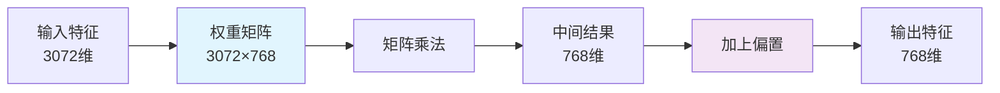

---
tags:
  - 基础知识
  - code
  - 人脸检测
  - 升维
  - 降维
  - MLP
---

## 📚 核心概念

### 什么是升维与降维？
- **升维**：将低维特征映射到高维空间，创造更丰富的特征组合
- **降维**：将高维特征压缩回低维空间，提炼核心信息
- **关系**：两者使用相同的数学原理，但实现相反的功能

---

## 🧮 数学原理详解

### 基础公式
无论是升维还是降维，都使用相同的线性变换公式：

$Y = X \cdot W^T + b$

### 公式分解
| 符号 | 含义 | 作用 |
|------|------|------|
| $Y$ | 输出特征 | 变换后的结果 |
| $X$ | 输入特征 | 原始特征向量 |
| $W^T$ | 权重矩阵转置 | 决定如何变换特征 |
| $b$ | 偏置向量 | 给每个输出特征加上微调 |

---

## 🚀 升维投影 (Upscaling)

### 数学过程
```python
# 输入: [batch_size, seq_len, input_dim]
# 输出: [batch_size, seq_len, hidden_dim]

# 公式: Y = X · W_up^T + b_up
# 其中: W_up ∈ ℝ^(hidden_dim × input_dim)
#      b_up ∈ ℝ^(hidden_dim)
```

### 维度变化


### 具体计算示例
假设输入特征 $X = [x_1, x_2, ..., x_{768}]$

每个输出特征 $y_j$ 的计算：
$y_j = \sum_{i=1}^{768} x_i \cdot w_{j,i} + b_j$

其中 $j = 1, 2, ..., 3072$

---

## 📉 降维投影 (Downscaling)

### 数学过程
```python
# 输入: [batch_size, seq_len, hidden_dim]  
# 输出: [batch_size, seq_len, output_dim]

# 公式: Y = X · W_down^T + b_down
# 其中: W_down ∈ ℝ^(output_dim × hidden_dim)
#      b_down ∈ ℝ^(output_dim)
```

### 维度变化


### 具体计算示例
假设输入特征 $X = [x_1, x_2, ..., x_{3072}]$

每个输出特征 $y_j$ 的计算：
$y_j = \sum_{i=1}^{3072} x_i \cdot w_{j,i} + b_j$

其中 $j = 1, 2, ..., 768$

---

## 💻 PyTorch代码实现

### 基础线性层实现
```python
import torch
import torch.nn as nn

class LinearProjection(nn.Module):
    """线性投影层 - 实现升维或降维"""
    
    def __init__(self, input_dim, output_dim):
        super().__init__()
        # 权重矩阵 W: [output_dim, input_dim]
        self.weight = nn.Parameter(torch.randn(output_dim, input_dim))
        # 偏置向量 b: [output_dim]
        self.bias = nn.Parameter(torch.zeros(output_dim))
        
    def forward(self, x):
        # x: [batch_size, seq_len, input_dim]
        # 应用公式: Y = X · W^T + b
        output = torch.matmul(x, self.weight.T) + self.bias
        # output: [batch_size, seq_len, output_dim]
        return output
```

### 完整MLP层实现
```python
class MLPWithProjection(nn.Module):
    """包含升维和降维的完整MLP层"""
    
    def __init__(self, dim, mlp_ratio=4.0, drop_rate=0.1):
        super().__init__()
        
        # 计算隐藏层维度
        mlp_hidden_dim = int(dim * mlp_ratio)
        
        # 升维投影: dim → mlp_hidden_dim
        self.up_proj = nn.Linear(dim, mlp_hidden_dim)
        
        # 激活函数
        self.activation = nn.GELU()
        
        # Dropout层
        self.dropout1 = nn.Dropout(drop_rate)
        
        # 降维投影: mlp_hidden_dim → dim
        self.down_proj = nn.Linear(mlp_hidden_dim, dim)
        
        # 最终Dropout
        self.dropout2 = nn.Dropout(drop_rate)
        
    def forward(self, x):
        """
        输入: x [batch_size, seq_len, dim]
        输出: [batch_size, seq_len, dim]
        """
        # 1. 升维投影
        x_up = self.up_proj(x)  # [batch, seq_len, mlp_hidden_dim]
        
        # 2. 激活函数
        x_act = self.activation(x_up)
        
        # 3. 第一次Dropout
        x_drop1 = self.dropout1(x_act)
        
        # 4. 降维投影
        x_down = self.down_proj(x_drop1)  # [batch, seq_len, dim]
        
        # 5. 最终Dropout
        output = self.dropout2(x_down)
        
        return output
```

### 测试代码
```python
def test_projection():
    """测试升维和降维功能"""
    
    # 创建模型
    dim = 768
    mlp_ratio = 4.0
    mlp = MLPWithProjection(dim, mlp_ratio)
    
    # 创建测试数据
    batch_size = 2
    seq_len = 197  # ViT中的token数量
    x = torch.randn(batch_size, seq_len, dim)
    
    print(f"输入形状: {x.shape}")  # [2, 197, 768]
    
    # 前向传播
    output = mlp(x)
    print(f"输出形状: {output.shape}")  # [2, 197, 768]
    
    # 检查升维投影的权重形状
    print(f"升维权重形状: {mlp.up_proj.weight.shape}")  # [3072, 768]
    print(f"降维权重形状: {mlp.down_proj.weight.shape}")  # [768, 3072]

# 运行测试
if __name__ == "__main__":
    test_projection()
```

---

## 🔍 深入理解

### 权重矩阵的作用
- **升维权重**：学习如何从少量特征创造丰富组合
- **降维权重**：学习如何从丰富特征提炼核心信息

### 偏置的作用
- 给每个输出特征提供基础偏移
- 帮助模型学习更复杂的模式

### 为什么需要先升维再降维？
1. **特征增强**：在高维空间创造更多特征组合
2. **非线性引入**：配合激活函数学习复杂模式
3. **信息压缩**：强迫模型学习最重要的特征
4. **维度对齐**：与残差连接配合使用

---

## 🎯 实际应用场景

### 在Transformer中的应用
```python
# ViT中的MLP层配置
dim = 768
mlp_ratio = 4.0  # 隐藏层维度 = 768 × 4 = 3072

# 数据流:
# 输入: [batch, 197, 768]
# → 升维: [batch, 197, 3072]  
# → GELU激活
# → 降维: [batch, 197, 768]
# → 输出
```

### 在其他架构中的应用
- **CNN**：1×1卷积实现通道维度的升维降维
- **Autoencoder**：编码器降维，解码器升维
- **Attention**：QKV投影也是线性变换

---

## 📊 性能分析

### 计算复杂度
| 操作 | 计算量 | 参数量 |
|------|--------|--------|
| 升维投影 | $B × S × D_{in} × D_{out}$ | $D_{in} × D_{out} + D_{out}$ |
| 降维投影 | $B × S × D_{in} × D_{out}$ | $D_{in} × D_{out} + D_{out}$ |

其中：
- $B$: batch size
- $S$: sequence length  
- $D_{in}$: 输入维度
- $D_{out}$: 输出维度

---

## 💡 学习要点总结

### 关键理解
- ✅ **数学原理相同**：升维降维都用 $Y = XW^T + b$
- ✅ **权重矩阵不同**：决定是升维还是降维
- ✅ **维度变化**：由权重矩阵的形状决定
- ✅ **偏置作用**：提供基础偏移，增强表达能力

### 实践建议
- 🎯 **理解权重形状**：记住 `[输出维度, 输入维度]`
- 🎯 **调试技巧**：打印权重形状验证维度变化
- 🎯 **性能优化**：注意计算复杂度和内存占用

> 💫 **流萤的小提示**：开拓者要记住哦，升维和降维就像呼吸一样，一个吸气（扩展），一个呼气（压缩），它们配合起来才能让神经网络更好地学习和表达呢！多写代码实践，理解会更深刻哦～ (๑•̀ㅂ•́)و✧