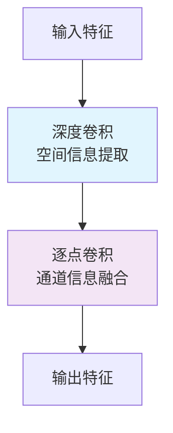
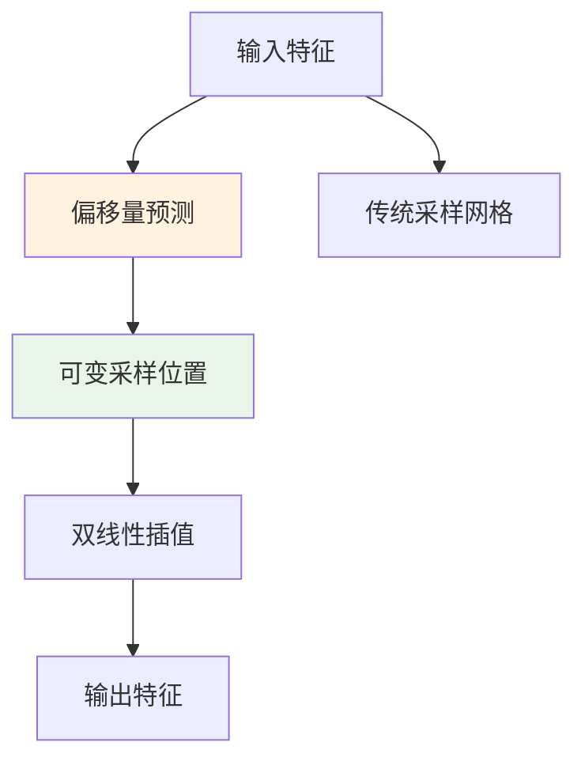

---
tags:
  - 基础知识
  - 卷积
  - 深度可分离卷积
  - 可变卷积
---


## 📚 核心概念

### 传统卷积 (Standard Convolution)
**就像一次性处理所有信息的大管家**
- 同时处理空间信息和通道信息
- 计算量大，但功能全面

**数学表达**：
```
计算量 = 输入通道 × 输出通道 × 卷积核宽 × 卷积核高
```

---

## 🔧 深度可分离卷积 (Depthwise Separable Convolution)

### 基本思想
**把复杂任务拆分成两个简单步骤**

### 两步流程


### 详细分解
1. **深度卷积 (Depthwise Convolution)**
   - 每个输入通道单独处理
   - 只提取空间特征
   - 保持通道数不变

2. **逐点卷积 (Pointwise Convolution)**
   - 1×1卷积核
   - 跨通道信息融合
   - 调整输出通道数

### 计算优势
```python
# 传统卷积计算量
traditional = in_channels × out_channels × kernel_w × kernel_h

# 深度可分离卷积计算量  
depthwise_separable = in_channels × kernel_w × kernel_h + in_channels × out_channels

# 计算量减少比例
reduction_ratio = 1/(1/out_channels + 1/(kernel_w×kernel_h))
```

### 应用场景
- 📱 **移动端部署**：计算资源有限
- ⚡ **实时检测**：需要快速推理
- 💾 **模型压缩**：减少参数量
- 🔋 **能耗优化**：降低功耗

---

## 🎯 可变卷积 (Deformable Convolution)

### 基本思想
**给卷积核装上"智能眼睛"，自适应调整感受野**

### 核心组件


### 关键技术
1. **偏移量学习**
   - 额外卷积层预测每个采样点的偏移量
   - 学习输入特征的几何形变

2. **可变形采样**
   - 根据偏移量调整采样位置
   - 适应物体形状变化

3. **双线性插值**
   - 处理非整数坐标采样
   - 保证梯度可传播

### 应用场景
- 🎭 **面部表情变化**：适应表情引起的形变
- ✂️ **不规则篡改**：处理非矩形篡改区域
- 🔄 **几何变换**：应对旋转、缩放等攻击
- 🎨 **艺术风格**：处理风格化的人脸

---

## 🎪 在人脸篡改检测中的应用

### 深度可分离卷积的应用
**优势**：
- 🚀 **高效检测**：适合实时防伪系统
- 💰 **成本控制**：降低硬件要求
- 📊 **多尺度特征**：提取不同粒度伪造痕迹

**适用场景**：
- 移动端人脸识别
- 实时视频流检测
- 边缘计算设备

### 可变卷积的应用
**优势**：
- 🔍 **精确边界**：准确定位篡改区域
- 🎯 **形变适应**：处理面部表情变化
- 📏 **几何鲁棒**：应对各种攻击手段

**适用场景**：
- 高精度篡改检测
- 复杂形变处理
-  forensic分析

---

## 📊 性能对比分析

### 计算效率对比
| 卷积类型 | 计算量 | 参数量 | 内存占用 | 推理速度 |
|---------|--------|--------|----------|----------|
| 传统卷积 | 100% | 100% | 100% | 基准 |
| 深度可分离 | 12% | 11% | 15% | 3-5倍 |
| 可变卷积 | 130% | 125% | 140% | 0.7倍 |

### 检测精度对比
| 卷积类型 | 简单篡改 | 复杂形变 | 边界精度 | 整体性能 |
|---------|----------|----------|----------|----------|
| 传统卷积 | ⭐⭐⭐⭐ | ⭐⭐⭐ | ⭐⭐⭐ | ⭐⭐⭐⭐ |
| 深度可分离 | ⭐⭐⭐ | ⭐⭐ | ⭐⭐⭐ | ⭐⭐⭐ |
| 可变卷积 | ⭐⭐⭐⭐ | ⭐⭐⭐⭐⭐ | ⭐⭐⭐⭐⭐ | ⭐⭐⭐⭐ |

---

## 💡 实践建议

### 选择策略
1. **资源受限场景** → 深度可分离卷积
2. **精度优先场景** → 可变卷积  
3. **平衡场景** → 混合使用

### 组合使用示例
```python
# 伪代码示例
class HybridConvBlock(nn.Module):
    def __init__(self):
        # 深度可分离卷积 - 高效特征提取
        self.depthwise = DepthwiseSeparableConv()
        # 可变卷积 - 精确边界处理
        self.deformable = DeformableConv()
        
    def forward(self, x):
        # 先用深度可分离卷积提取基础特征
        base_features = self.depthwise(x)
        # 再用可变卷积处理复杂形变
        refined_features = self.deformable(base_features)
        return refined_features
```

---

## 🎓 学习要点总结

### 深度可分离卷积
- ✅ **优点**：计算高效、参数少、适合移动端
- ❌ **缺点**：表达能力稍弱、精度略有损失
- 🎯 **记住**："分两步走，效率更高"

### 可变卷积
- ✅ **优点**：自适应感受野、形变鲁棒、边界精确
- ❌ **缺点**：计算复杂、训练困难
- 🎯 **记住**："智能眼睛，自适应调整"

### 实际应用
- 🔄 **灵活组合**：根据需求选择合适卷积
- 📈 **性能权衡**：在精度和效率间找到平衡
- 🎨 **创新思维**：可以设计新的卷积变体

---

> 💫 **流萤的小提示**：开拓者要记住哦，这些卷积就像不同的工具，没有绝对的好坏，只有适不适合当前的任务～多实践才能更好地掌握它们呢！ (๑•̀ㅂ•́)و✧