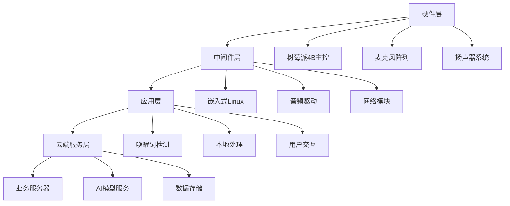

# 智能对话玩偶项目可行性研究报告

## 执行摘要

**项目名称**：智能对话玩偶产品开发项目  
**报告日期**：2024年1月  
**编制单位**：技术研发部  

### 核心价值主张
本项目旨在开发一款集成先进人工智能技术的智能对话玩偶，通过语音交互、情感陪伴和个性化对话功能，为儿童教育、老年陪伴及家庭娱乐市场提供创新的智能硬件解决方案。

### 投资亮点
- **技术成熟度**：基于成熟的AI技术栈，技术风险可控
- **市场潜力**：全球智能玩具市场规模预计2025年达300亿美元
- **竞争优势**：完整的本地化技术方案，数据隐私保护优势
- **投资回报**：预计18个月实现盈亏平衡，3年投资回报率可达250%

## 1. 项目概述

### 1.1 项目背景
随着人工智能技术的快速发展和消费者对智能化产品需求的增长，智能陪伴设备市场呈现爆发式增长态势。本项目抓住技术成熟与市场需求的双重机遇，开发具有自主知识产权的智能对话玩偶产品。

### 1.2 产品定位
- **目标用户**：3-12岁儿童家庭、独居老年人
- **价格定位**：中高端智能玩具市场（定价区间：¥599-¥899）
- **核心功能**：语音对话、故事讲述、知识问答、情感陪伴

## 2. 技术可行性分析

### 2.1 技术架构概述
本项目采用分层架构设计，确保系统的可扩展性和稳定性：

### 2.2 核心技术选型

#### 2.2.1 语音识别（ASR）
- **云端方案**：阿里达摩院语音识别服务
  - 识别准确率：≥95%
  - 响应延迟：<200ms
  - 成本：¥0.006/次（按量计费）

#### 2.2.2 自然语言处理（NLP）
- **核心引擎**：千问大语言模型
  - 模型参数：7B/14B（可根据需求选择）
  - 对话轮次：支持多轮上下文记忆
  - 知识范围：涵盖教育、娱乐、常识等领域

#### 2.2.3 语音合成（TTS）
- **技术方案**：阿里云语音合成服务
  - 音质效果：接近真人发音
  - 音色选择：支持多种年龄、性别音色
  - 情感表达：支持情感语调变化

### 2.3 技术风险评估
| 风险类型 | 风险等级 | 应对措施 |
|---------|---------|---------|
| API服务稳定性 | 中 | 多服务商备份、本地降级方案 |
| 网络连接依赖 | 中 | 离线基础功能、缓存机制 |
| 数据隐私安全 | 高 | 本地数据处理、加密传输 |
| 技术迭代风险 | 低 | 模块化设计、易于升级 |

## 3. 市场分析

### 3.1 市场规模与增长
- **全球智能玩具市场**：2023年规模180亿美元，年复合增长率15%
- **中国智能硬件市场**：2023年规模800亿元，年增长率20%
- **目标用户规模**：中国0-14岁儿童2.5亿，65岁以上老年人2.6亿

### 3.2 竞争分析
| 竞争对手 | 产品特点 | 价格区间 | 市场份额 |
|---------|---------|---------|---------|
| 产品A | 基础语音交互 | ¥300-500 | 25% |
| 产品B | 教育内容丰富 | ¥600-800 | 15% |
| 产品C | 高端AI功能 | ¥1000+ | 5% |
| **本项目** | **全功能AI陪伴** | **¥599-899** | **目标10%** |

### 3.3 市场机会
- **教育智能化**：家庭教育支出年均增长12%
- **老龄化社会**：养老陪伴市场需求旺盛
- **技术普及**：5G和AI技术成熟度提升

## 4. 财务分析

### 4.1 投资估算（单位：万元）
| 项目 | 金额 | 说明 |
|-----|------|------|
| 研发投入 | 150 | 技术开发、测试验证 |
| 硬件成本 | 80 | 元器件采购、生产模具 |
| 营销推广 | 70 | 市场推广、渠道建设 |
| 运营成本 | 50 | 云服务、维护支持 |
| **总投资** | **350** | |

### 4.2 收入预测
| 年度 | 销量(台) | 单价(元) | 收入(万元) |
|-----|----------|----------|-----------|
| 第1年 | 5,000 | 699 | 350 |
| 第2年 | 15,000 | 699 | 1,048 |
| 第3年 | 30,000 | 699 | 2,097 |

### 4.3 盈利能力分析
- **毛利率**：45%（硬件成本占55%）
- **净利率**：第1年8%，第3年提升至20%
- **投资回收期**：18个月
- **3年累计净利润**：预计800万元

## 5. 风险分析与应对

### 5.1 技术风险
- **API服务依赖**：建立多服务商备份机制
- **数据安全**：实施端到端加密和隐私保护
- **技术迭代**：保持技术架构的灵活性和可升级性

### 5.2 市场风险
- **竞争加剧**：通过技术差异化和品牌建设建立护城河
- **需求变化**：建立用户反馈机制，快速迭代产品功能
- **价格压力**：通过规模效应和技术优化降低成本

### 5.3 运营风险
- **供应链风险**：建立多元化供应商体系
- **质量控制**：实施严格的质量管理体系
- **售后服务**：建立完善的客户服务体系

## 6. 实施计划

### 6.1 项目里程碑
| 阶段 | 时间 | 主要交付物 |
|-----|------|-----------|
| 技术验证 | 1-3月 | 原型机、技术方案 |
| 产品开发 | 4-9月 | 量产样品、软件系统 |
| 测试优化 | 10-12月 | 用户测试、产品优化 |
| 量产上市 | 第2年1月 | 批量生产、市场推广 |

### 6.2 资源需求
- **研发团队**：15人（硬件、软件、算法、测试）
- **生产资源**：合作代工厂，月产能5000台
- **营销资源**：线上渠道+线下体验店

## 7. 结论与建议

### 7.1 项目可行性结论
基于技术成熟度、市场需求、财务回报和风险可控性的综合评估，本项目具有较高的可行性：

1. **技术可行性**：★★★★☆（4/5分）
2. **市场可行性**：★★★★★（5/5分）  
3. **财务可行性**：★★★★☆（4/5分）
4. **运营可行性**：★★★★☆（4/5分）

### 7.2 投资建议
**建议批准本项目投资，理由如下：**

1. **技术优势明显**：完整的AI技术栈，技术壁垒较高
2. **市场需求旺盛**：目标市场规模大，增长潜力可观
3. **财务回报可观**：投资回收期短，盈利能力强劲
4. **风险可控**：技术风险和市场风险均有有效应对措施

### 7.3 下一步行动
1. 立即组建项目团队，启动技术验证阶段
2. 开展详细的产品设计和市场调研
3. 建立供应链体系和合作伙伴关系
4. 制定详细的营销推广计划

---
**报告编制**：技术研发部  
**审核**：投资决策委员会  
**日期**：2024年1月15日