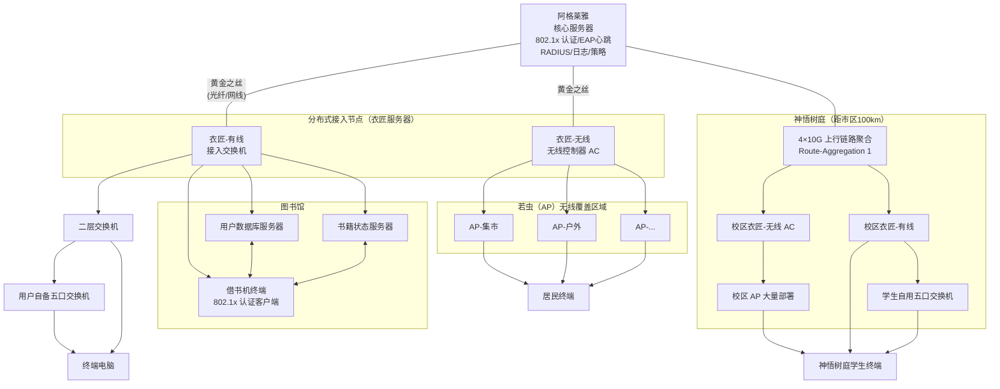

## 🌌 奥赫玛城网络拓扑结构图

```mermaid
graph TD
    %% 核心：阿格莱雅
    AGLAIA[阿格莱雅<br/>核心服务器<br/>802.1x 认证/EAP心跳<br/>RADIUS/日志/策略]

    %% 分布式衣匠（接入交换机）
    subgraph CLOTHIERS[分布式接入节点（衣匠服务器）]
        direction LR
        C1[衣匠-有线<br/>接入交换机]
        C2[衣匠-无线<br/>无线控制器 AC]
    end

    %% 光纤连接
    AGLAIA ---|"黄金之丝<br/>(光纤/网线)"| C1
    AGLAIA ---|"黄金之丝"| C2

    %% 无线AP集群
    subgraph APs[若虫（AP）无线覆盖区域]
        direction LR
        AP1[AP-集市]
        AP2[AP-户外]
        AP3[AP-...]
    end
    C2 --> AP1
    C2 --> AP2
    C2 --> AP3

    %% 有线端口接入
    C1 --> S1["二层交换机"]
    S1 --> S2["用户自备五口交换机"]
    S1 --> PC_USER[终端电脑]
    S2 --> PC_USER[终端电脑]

    %% 图书馆借书机
    subgraph LIBRARY[图书馆]
        BOOK[借书机终端<br/>802.1x 认证客户端]
        USER_DB[用户数据库服务器]
        BOOK_DB[书籍状态服务器]
    end
    C1 --> BOOK
    C1 --> USER_DB
    C1 --> BOOK_DB
    USER_DB <--> BOOK
    BOOK_DB <--> BOOK

    %% 神悟树庭（远端校区）
    subgraph SCHOOL["神悟树庭（距市区100km）"]
        direction TB
        RA[4×10G 上行链路聚合<br/>Route-Aggregation 1]
        SC1[校区衣匠-有线]
        SC2[校区衣匠-无线 AC]
        AP_S1[校区 AP 大量部署]
        EX5[学生自用五口交换机]
    end

    AGLAIA --- RA
    RA --> SC2
    RA --> SC1
    SC2 --> AP_S1

    %% 终端设备
    AP1 --> USER1[居民终端]
    AP2 --> USER1[居民终端]
    AP3 --> USER1[居民终端]
    AP_S1 --> USER3[神悟树庭学生终端]
    SC1 --> USER3[神悟树庭学生终端]
    SC1 --> EX5[学生自用五口交换机]
	EX5 --> USER3[神悟树庭学生终端]
```

